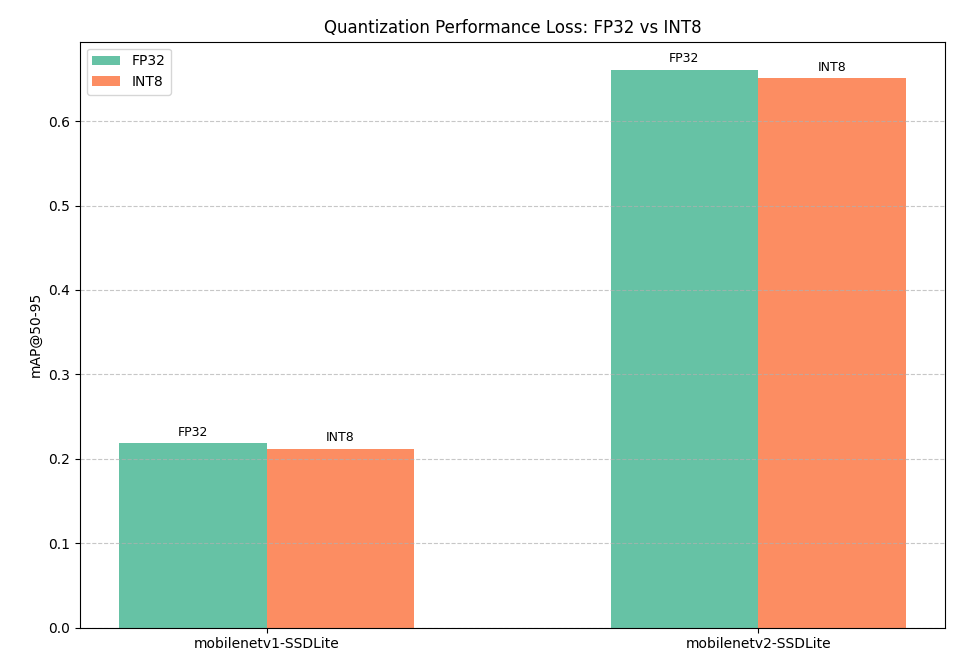

# SSD-Lite Series Benchmark on TCC750x

The following is benchmark data for various **SSD-Lite (Single Shot MultiBox Detector Lite)** object detection models running on the **TCC750x (N-Dolphin)** platform.  
SSD-Lite is a lightweight and efficient object detection model designed for mobile and embedded devices, offering a good trade-off between speed and accuracy.  
It is a variant of the original SSD model with depthwise separable convolutions for reduced computation.

This benchmark includes popular SSD-Lite models (e.g., MobileNet-SSD, MobileNetV2-SSD) and provides insight into their performance when quantized and deployed on embedded hardware.

You can also clisk on the model name in the table to download the binary that can run on the TCC750x EVB.

---

### 📊 Table Overview

| Column                    | Description                                                                 |
|--------------------------|-----------------------------------------------------------------------------|
| **Model**                | Name of the neural network model     |
| **Framework**            | Deep learning framework used (e.g., PyTorch, TFLite, ONNX)                  |
| **Dataset**              | Evaluation dataset (COCO val2017 or VOC2007 test set)                       |
| **Input Size (WxHxC)**   | Model input resolution and channel configuration                            |
| **Quantization Bit**     | Bit-depth used for quantization (e.g., INT8)                                |
| **Binary Files Info.**   | Size of the compiled neural network binaries for TCC750x                    |
| **Inference Time (ms)**  | Inference time measured on the TCC750x EVB using zero-padded input images.                               |
| **mAP**             | mAP (mean Average Precision) is evaluated on the **COCO val2017** (5,000 images) or the **VOC2007 test dataset** (4,952 images).                    |
| **References**           | Link to the original GitHub repository of the model                         |

---

<!--
아래는 TCC750X에서 실행되는 Object Detection 모델의 벤치마크 자료입니다.
이 표를 통해 각 신경망이 N-Dolphin (TCC750X) 보드에서 실행될 때의 성능을 확인할 수 있습니다.
또한, 신경망 이름을 클릭하면 해당 보드에서 실행할 수 있는 형식의 결과물을 다운로드할 수 있습니다.

참조사항
Detections/Dataset: COCO
Evaluation: tc-nn-toolkit을 이용하여 측정한 결과입니다.
- Evaluation Result의 FP32: .enlight 확장자로 변환된 상태에서 측정된 값입니다.
Inference Time: N-Dolphin EVB에서 실행한 결과입니다.
Reference: 신경망 모델의 원본 GitHub 링크로 연결됩니다.
-->

<table border="1" cellspacing="0" cellpadding="5">
    <thead>
        <tr>
            <th align="center" rowspan="2" colspan="1">Model</th>
            <th rowspan="2">Framework</th>
            <th rowspan="2">Dataset</th>
            <th rowspan="2">Input Size (WxHxC)</th>
            <th rowspan="2">Quantization Bit</th>
            <th colspan="2">Binary Files Info.</th>
            <th rowspan="2">Inference Time(ms)</th>
            <th colspan="2">mAP@50-95</th>
            <th rowspan="2">References</th>
        </tr>
        <tr>
            <th>Weight & Bias Bin.(MB)</th>
            <th>Command Bin.(KB)</th>
            <th>FP32</th>
            <th>INT8</th>
        </tr>
    </thead>
    <tbody>
        <tr>
            <td align="center" class="variant"><a href="MobileNet/lite-model_ssd_mobilenet_v1_100_320_fp32_nms_1/">mobilenetv1-SSDLite</a></td>
            <td align="center">TFLite</td> <!-- Framework -->
            <td align="center">COCO</td> <!-- Detections/DataSet -->
            <td align="center">320x320x3</td> <!-- Input Size (WxHxC) -->
            <td align="center">INT8</td> <!-- Quantization Bit -->
            <td align="center">8</td> <!-- Compiled NN Information: Weight, Bias Binary Size(MB) -->
            <td align="center">44</td> <!-- Compiled NN Information: Command Binary Size(KB) -->
            <td align="center">2.54</td> <!-- Inference Time(msec): EVB -->
            <td align="center">0.082</td> <!-- Evaluation Result: FP32 -->
            <td align="center">0.081</td> <!-- Evaluation Result: INT8 -->
            <td align="center"><a href="https://tfhub.dev/iree/lite-model/ssd_mobilenet_v1_100_320/fp32/nms/1">GitHub<a></td> <!-- References: Link -->
        </tr>
        <tr>
            <td align="center" class="variant"><a href="MobileNet/mb2_ssd_lite/">mobilenetv2-SSDLite</a></td> <!-- Model -->
            <td align="center">ONNX</td> <!-- Framework -->
            <td align="center">VOC2007</td> <!-- Detections/DataSet -->
            <td align="center">300x300x3</td> <!-- Input Size (WxHxC) -->
            <td align="center">INT8</td> <!-- Quantization Bit -->
            <td align="center">4</td> <!-- Compiled NN Information: Weight, Bias Binary Size(MB) -->
            <td align="center">56</td> <!-- Compiled NN Information: Command Binary Size(KB) -->
            <td align="center">2.08</td> <!-- Inference Time(msec): EVB -->
            <td align="center">0.661</td> <!-- Evaluation Result: FP32 -->
            <td align="center">0.651</td> <!-- Evaluation Result: INT8 -->
            <td align="center"><a href="https://github.com/openedges/pytorch-ssd">GitHub<a></td> <!-- References: Link -->
        </tr>
    </tbody>
</table>

---
