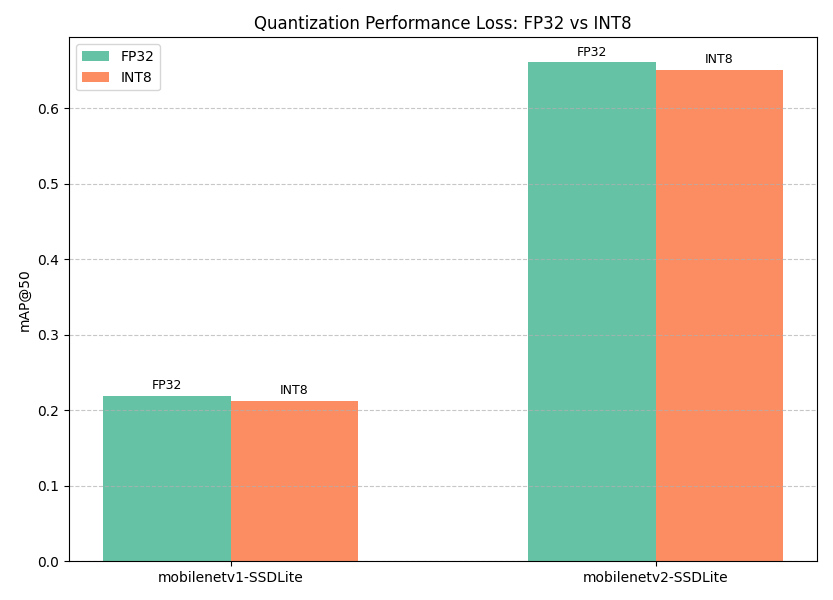

# SSD-Lite Series Benchmark on TCC750x

The following is benchmark data for various **SSD-Lite (Single Shot MultiBox Detector Lite)** object detection models running on the **TCC750x** platform.  
SSD-Lite is a lightweight and efficient object detection model designed for mobile and embedded devices, offering a good trade-off between speed and accuracy.  
SSD-Lite is a variant of the original SSD model with depthwise separable convolutions for reduced computation.

This benchmark includes popular SSD-Lite models (e.g., MobileNet-SSD and MobileNetV2-SSD) and provides insight into their performance when quantized and deployed on TCC750x.

You can also click on the model name in the table to download the binary that can run on the TCC750x.

---

### 📊 Table Overview

| Column                    | Description                                                                 |
|--------------------------|-----------------------------------------------------------------------------|
| **Model**                | Name of the neural network model     |
| **Framework**            | Deep learning framework used (e.g., PyTorch, TFLite, ONNX)                  |
| **Dataset**              | Evaluation dataset                                                           |
| **Input Size (WxHxC)**   | Model input resolution and channel configuration                            |
| **Quantization Bit**     | Bit-depth used for quantization (e.g., INT8)                                |
| **Binary Files Information**   | Size of the compiled neural network binaries for TCC750x                    |
| **Inference Time (ms)**  | Inference time measured on the TCC750x EVB using zero-padded input images.                               |
| **mAP**             | Mean Average Precision (mAP) is evaluated on the **COCO val2017** (5,000 images) or the **VOC2007 test dataset** (4,952 images)                    |
| **References**           | Link to the original GitHub repository of the model                         |

---

<table border="1" cellspacing="0" cellpadding="5">
    <thead>
        <tr>
            <th align="center" rowspan="2" colspan="1">Model</th>
            <th rowspan="2">Framework</th>
            <th rowspan="2">Dataset</th>
            <th rowspan="2">Input Size (WxHxC)</th>
            <th rowspan="2">Quantization Bit</th>
            <th colspan="2">Binary Files Information</th>
            <th rowspan="2">Inference Time (ms)</th>
            <th colspan="2">mAP@50:95</th>
            <th th align="center" colspan="2">mAP@50</th>
            <th rowspan="2">References</th>
        </tr>
        <tr>
            <th>Weight & Bias Binary (MB)</th>
            <th>Command Binary (KB)</th>
            <th>FP32</th>
            <th>INT8</th>
            <th>FP32</th>
            <th>INT8</th>
        </tr>
    </thead>
    <tbody>
        <tr>
            <td align="center" class="variant"><a href="./lite-model_ssd_mobilenet_v1_100_320_fp32_nms_1/">mobilenetv1-SSDLite</a></td>
            <td align="center">TFLite</td> <!-- Framework -->
            <td align="center">COCO</td> <!-- Detections/DataSet -->
            <td align="center">320x320x3</td> <!-- Input Size (WxHxC) -->
            <td align="center">INT8</td> <!-- Quantization Bit -->
            <td align="center">8</td> <!-- Compiled NN Information: Weight, Bias Binary Size(MB) -->
            <td align="center">44</td> <!-- Compiled NN Information: Command Binary Size(KB) -->
            <td align="center">2.54</td> <!-- Inference Time(msec): EVB -->
            <td align="center">0.219</td> <!-- Evaluation Result: FP32 -->
            <td align="center">0.212</td> <!-- Evaluation Result: INT8 -->
            <td align="center">0.376</td> <!-- Evaluation Result: FP32 IoU=0.50 -->
            <td align="center">0.367</td> <!-- Evaluation Result: INT8 IoU=0.50 -->
            <td align="center"><a href="https://tfhub.dev/iree/lite-model/ssd_mobilenet_v1_100_320/fp32/nms/1">GitHub<a></td> <!-- References: Link -->
        </tr>
        <tr>
            <td align="center" class="variant"><a href="./mb2_ssd_lite/">mobilenetv2-SSDLite</a></td> <!-- Model -->
            <td align="center">ONNX</td> <!-- Framework -->
            <td align="center">VOC2007</td> <!-- Detections/DataSet -->
            <td align="center">300x300x3</td> <!-- Input Size (WxHxC) -->
            <td align="center">INT8</td> <!-- Quantization Bit -->
            <td align="center">4</td> <!-- Compiled NN Information: Weight, Bias Binary Size(MB) -->
            <td align="center">56</td> <!-- Compiled NN Information: Command Binary Size(KB) -->
            <td align="center">2.08</td> <!-- Inference Time(msec): EVB -->
            <td align="center">-</td> <!-- Evaluation Result: FP32 -->
            <td align="center">-</td> <!-- Evaluation Result: INT8 -->
            <td align="center">0.661</td> <!-- Evaluation Result: FP32 IoU=0.50 -->
            <td align="center">0.651</td> <!-- Evaluation Result: INT8 IoU=0.50 -->
            <td align="center"><a href="https://github.com/openedges/pytorch-ssd">GitHub<a></td> <!-- References: Link -->
        </tr>
    </tbody>
</table>

---

## 📤 Output Format

- The output of an SSDLite model is a set of bounding boxes with associated class predictions and confidence scores.
- These raw outputs undergo post-processing, which includes:
  - Applying sigmoid/softmax activations to normalize outputs
  - Filtering boxes based on confidence thresholds
  - Applying Non-Maximum Suppression (NMS) to remove overlapping boxes

- The final post-processed output includes a list of detected objects, each containing:
  - Class label
  - Confidence score
  - Bounding box coordinates (x_min, y_min, x_max, and y_max)
    
- The maximum number of detections is 256

