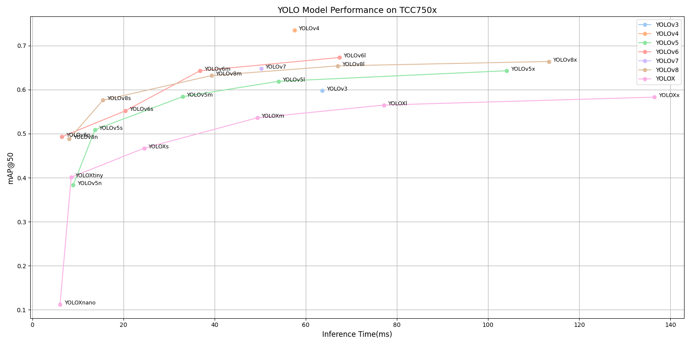

# YOLO Series Benchmark on TCC750x

The following is benchmark data for various **YOLO (You Only Look Once)** object detection models that run on the **TCC750x** platform.  
YOLO models are widely known for their real-time performance and high accuracy in detecting multiple objects in a single pass over the image.  
This benchmark covers multiple YOLO versions (v3 to v8, YOLOX, YOLOv6, and so on), providing insight into their speed and detection accuracy on TCC750x.

You can also click on the model name in the table allows you to download the binary that can run on the TCC750x. 

---

### 📊 Table Overview

| Column                    | Description                                                                 |
|--------------------------|-----------------------------------------------------------------------------|
| **Model**                | Name of the neural network model     |
| **Framework**            | Deep learning framework used (e.g., PyTorch, TFLite, ONNX)                  |
| **Dataset**              | Evaluation dataset                                                           |
| **Input Size (WxHxC)**   | Model input resolution and channel configuration                            |
| **Quantization Bit**     | Bit-depth used for quantization (e.g., INT8)                                |
| **Binary Files Information**   | Size of the compiled neural network binaries for TCC750x                    |
| **Inference Time (ms)**  | Inference time measured on the N-Dolphin EVB by using zero-padded input images                             |
| **mAP**             | Mean Average Precision (mAP) is evaluated on the **COCO val2017 dataset** (5,000 images)                    |
| **References**           | Link to the original GitHub repository of the model                         |

---

<!--
아래는 TCC750X에서 실행되는 Object Detection 모델의 벤치마크 자료입니다.
이 표를 통해 각 신경망이 N-Dolphin (TCC750X) 보드에서 실행될 때의 성능을 확인할 수 있습니다.
또한, 신경망 이름을 클릭하면 해당 보드에서 실행할 수 있는 형식의 결과물을 다운로드할 수 있습니다.

참조사항
Detections/Dataset: COCO
Evaluation: tc-nn-toolkit을 이용하여 측정한 결과입니다.
- Evaluation Result의 FP32: .enlight 확장자로 변환된 상태에서 측정된 값입니다.
Inference Time: N-Dolphin EVB에서 실행한 결과입니다.
Reference: 신경망 모델의 원본 GitHub 링크로 연결됩니다.
-->

<table border="1" cellspacing="0" cellpadding="5">
    <thead>
        <tr>
            <th align="center" rowspan="2" colspan="2">Model</th>
            <th th align="center" rowspan="2">Framework</th>
            <th th align="center" rowspan="2">Dataset</th>
            <th th align="center" rowspan="2">Input Size (WxHxC)</th>
            <th th align="center" rowspan="2">Quantization Bit</th>
            <th th align="center" colspan="2">Binary Files Information</th>
            <th th align="center" rowspan="2">Inference Time (ms)</th>
            <th th align="center" colspan="2">mAP@50:95</th>
            <th th align="center" colspan="2">mAP@50</th>
            <th th align="center" rowspan="2">References</th>
        </tr>
        <tr>
            <th>Weight and Bias Binary (MB)</th>
            <th>Command Binary (KB)</th>
            <th>FP32</th>
            <th>INT8</th>
            <th>FP32</th>
            <th>INT8</th>
        </tr>
    </thead>
    <tbody>
        <tr>
            <td align="center" colspan="2"><a href="./yolov3/">YOLOv3</a></td> <!-- Model -->
            <td align="center">PyTorch</td> <!-- Framework -->
            <td align="center">COCO</td> <!-- Detections/DataSet -->
            <td align="center">640x640x3</td> <!-- Input Size (WxHxC) -->
            <td align="center">INT8</td> <!-- Quantization Bit -->
            <td align="center">60</td> <!-- Compiled NN Information: Weight, Bias Binary Size(MB) -->
            <td align="center">232</td> <!-- Compiled NN Information: Command Binary Size(KB) -->
            <td align="center">63.60</td> <!-- Inference Time(msec): EVB -->
            <td align="center">0.439</td> <!-- Evaluation Result: FP32 IoU=0.50:0.95 -->
            <td align="center">0.386</td> <!-- Evaluation Result: INT8 IoU=0.50:0.95 -->
            <td align="center">0.630</td> <!-- Evaluation Result: FP32 IoU=0.50 -->
            <td align="center">0.598</td> <!-- Evaluation Result: INT8 IoU=0.50 -->
            <td align="center"><a href="https://github.com/ultralytics/yolov3">GitHub<a></td> <!-- References: Link -->
        </tr>
        <tr>
            <td align="center" colspan="2"><a href="./yolov4/">YOLOv4</a></td> <!-- Model -->
            <td align="center">Darknet</td> <!-- Framework -->
            <td align="center">COCO</td> <!-- Detections/DataSet -->
            <td align="center">608x608x3</td> <!-- Input Size (WxHxC) -->
            <td align="center">INT8</td> <!-- Quantization Bit -->
            <td align="center">62</td> <!-- Compiled NN Information: Weight, Bias Binary Size(MB) -->
            <td align="center">308</td> <!-- Compiled NN Information: Command Binary Size(KB) -->
            <td align="center">57.50</td> <!-- Inference Time(msec): EVB -->
            <td align="center">0.501</td> <!-- Evaluation Result: FP32 IoU=0.50:0.95 -->
            <td align="center">0.402</td> <!-- Evaluation Result: INT8 IoU=0.50:0.95 -->
            <td align="center">0.748</td> <!-- Evaluation Result: FP32 IoU=0.50 -->
            <td align="center">0.735</td> <!-- Evaluation Result: INT8 IoU=0.50 -->
            <td align="center"><a href="https://github.com/AlexeyAB/darknet/blob/master/cfg/yolov4.cfg">Github<a></td> <!-- References: Link -->
        </tr>
        <tr>
            <td align="center" rowspan="5" class="model">YOLOv5</td> <!-- Model -->
            <td align="center" class="variant"><a href="./yolov5/yolov5n/">n</a></td>
            <td align="center">PyTorch</td> <!-- Framework -->
            <td align="center">COCO</td> <!-- Detections/DataSet -->
            <td align="center">640x640x3</td> <!-- Input Size (WxHxC) -->
            <td align="center">INT8</td> <!-- Quantization Bit -->
            <td align="center">2</td> <!-- Compiled NN Information: Weight, Bias Binary Size(MB) -->
            <td align="center">80</td> <!-- Compiled NN Information: Command Binary Size(KB) -->
            <td align="center">8.97</td> <!-- Inference Time(msec): EVB -->
            <td align="center">0.246</td> <!-- Evaluation Result: FP32 IoU=0.50:0.95 -->
            <td align="center">0.213</td> <!-- Evaluation Result: INT8 IoU=0.50:0.95 -->
            <td align="center">0.418</td> <!-- Evaluation Result: FP32 IoU=0.50 -->
            <td align="center">0.383</td> <!-- Evaluation Result: INT8 IoU=0.50 -->
            <td align="center" rowspan="5"><a href="https://github.com/ultralytics/yolov5">GitHub<a></td> <!-- References: Link -->
        </tr>
        <tr>
            <td align="center" class="variant"><a href="./yolov5/yolov5s/">s</a></td> <!-- Model -->
            <td align="center">PyTorch</td> <!-- Framework -->
            <td align="center">COCO</td> <!-- Detections/DataSet -->
            <td align="center">640x640x3</td> <!-- Input Size (WxHxC) -->
            <td align="center">INT8</td> <!-- Quantization Bit -->
            <td align="center">7</td> <!-- Compiled NN Information: Weight, Bias Binary Size(MB) -->
            <td align="center">144</td> <!-- Compiled NN Information: Command Binary Size(KB) -->
            <td align="center">13.74</td> <!-- Inference Time(msec): EVB -->
            <td align="center">0.342</td> <!-- Evaluation Result: FP32 IoU=0.50:0.95 -->
            <td align="center">0.303</td> <!-- Evaluation Result: INT8 IoU=0.50:0.95 -->
            <td align="center">0.533</td> <!-- Evaluation Result: FP32 IoU=0.50 -->
            <td align="center">0.509</td> <!-- Evaluation Result: INT8 IoU=0.50 -->
        </tr>
        <tr>
            <td align="center" class="variant"><a href="./yolov5/yolov5m/">m</a></td> <!-- Model -->
            <td align="center">PyTorch</td> <!-- Framework -->
            <td align="center">COCO</td> <!-- Detections/DataSet -->
            <td align="center">640x640x3</td> <!-- Input Size (WxHxC) -->
            <td align="center">INT8</td> <!-- Quantization Bit -->
            <td align="center">21</td> <!-- Compiled NN Information: Weight, Bias Binary Size(MB) -->
            <td align="center">188</td> <!-- Compiled NN Information: Command Binary Size(KB) -->
            <td align="center">32.96</td> <!-- Inference Time(msec): EVB -->
            <td align="center">0.424</td> <!-- Evaluation Result: FP32 IoU=0.50:0.95 -->
            <td align="center">0.385</td> <!-- Evaluation Result: INT8 IoU=0.50:0.95 -->
            <td align="center">0.610</td> <!-- Evaluation Result: FP32 IoU=0.50 -->
            <td align="center">0.584</td> <!-- Evaluation Result: INT8 IoU=0.50 -->
        </tr>
        <tr>
            <td align="center" class="variant"><a href="./yolov5/yolov5l/">l</a></td> <!-- Model -->
            <td align="center">PyTorch</td> <!-- Framework -->
            <td align="center">COCO</td> <!-- Detections/DataSet -->
            <td align="center">640x640x3</td> <!-- Input Size (WxHxC) -->
            <td align="center">INT8</td> <!-- Quantization Bit -->
            <td align="center">45</td> <!-- Compiled NN Information: Weight, Bias Binary Size(MB) -->
            <td align="center">308</td> <!-- Compiled NN Information: Command Binary Size(KB) -->
            <td align="center">54.01</td> <!-- Inference Time(msec): EVB -->
            <td align="center">0.461</td> <!-- Evaluation Result: FP32 IoU=0.50:0.95 -->
            <td align="center">0.406</td> <!-- Evaluation Result: INT8 IoU=0.50:0.95 -->
            <td align="center">0.644</td> <!-- Evaluation Result: FP32 IoU=0.50 -->
            <td align="center">0.619</td> <!-- Evaluation Result: INT8 IoU=0.50 -->
        </tr>
        <tr>
            <td align="center" class="variant"><a href="./yolov5/yolov5x/">x</a></td> <!-- Model -->
            <td align="center">PyTorch</td> <!-- Framework -->
            <td align="center">COCO</td> <!-- Detections/DataSet -->
            <td align="center">640x640x3</td> <!-- Input Size (WxHxC) -->
            <td align="center">INT8</td> <!-- Quantization Bit -->
            <td align="center">83</td> <!-- Compiled NN Information: Weight, Bias Binary Size(MB) -->
            <td align="center">460</td> <!-- Compiled NN Information: Command Binary Size(KB) -->
            <td align="center">104.11</td> <!-- Inference Time(msec): EVB -->
            <td align="center">0.478</td> <!-- Evaluation Result: FP32 IoU=0.50:0.95 -->
            <td align="center">0.437</td> <!-- Evaluation Result: INT8 IoU=0.50:0.95 -->
            <td align="center">0.660</td> <!-- Evaluation Result: FP32 IoU=0.50 -->
            <td align="center">0.643</td> <!-- Evaluation Result: INT8 IoU=0.50 -->
        </tr>
        <tr>
            <td align="center" rowspan="4" class="model">YOLOv6</td> <!-- Model -->
            <td align="center" class="variant"><a href="./yolov6/yolov6n/">n</a></td> <!-- Models: Variant -->
            <td align="center">PyTorch</td> <!-- Framework -->
            <td align="center">COCO</td> <!-- Detections/DataSet -->
            <td align="center">640x640x3</td> <!-- Input Size (WxHxC) -->
            <td align="center">INT8</td> <!-- Quantization Bit -->
            <td align="center">5</td> <!-- Compiled NN Information: Weight, Bias Binary Size(MB) -->
            <td align="center">40</td> <!-- Compiled NN Information: Command Binary Size(KB) -->
            <td align="center">6.50</td> <!-- Inference Time(msec): EVB -->
            <td align="center">0.353</td> <!-- Evaluation Result: FP32 IoU=0.50:0.95 -->
            <td align="center">0.332</td> <!-- Evaluation Result: INT8 IoU=0.50:0.95 -->
            <td align="center">0.514</td> <!-- Evaluation Result: FP32 IoU=0.50 -->
            <td align="center">0.493</td> <!-- Evaluation Result: INT8 IoU=0.50 -->
            <td align="center" rowspan="4"><a href="https://github.com/meituan/YOLOv6">GitHub<a></td> <!-- References: Link -->
        </tr>
        <tr>
            <td align="center" class="variant"><a href="./yolov6/yolov6s/">s</a></td> <!-- Model -->
            <td align="center">PyTorch</td> <!-- Framework -->
            <td align="center">COCO</td> <!-- Detections/DataSet -->
            <td align="center">640x640x3</td> <!-- Input Size (WxHxC) -->
            <td align="center">INT8</td> <!-- Quantization Bit -->
            <td align="center">18</td> <!-- Compiled NN Information: Weight, Bias Binary Size(MB) -->
            <td align="center">84</td> <!-- Compiled NN Information: Command Binary Size(KB) -->
            <td align="center">20.43</td> <!-- Inference Time(msec): EVB -->
            <td align="center">0.422</td> <!-- Evaluation Result: FP32 IoU=0.50:0.95 -->
            <td align="center">0.384</td> <!-- Evaluation Result: INT8 IoU=0.50:0.95 -->
            <td align="center">0.597</td> <!-- Evaluation Result: FP32 IoU=0.50 -->
            <td align="center">0.552</td> <!-- Evaluation Result: INT8 IoU=0.50 -->
        </tr>
        <tr>
            <td align="center" class="variant"><a href="./yolov6/yolov6m/">m</a></td> <!-- Model -->
            <td align="center">PyTorch</td> <!-- Framework -->
            <td align="center">COCO</td> <!-- Detections/DataSet -->
            <td align="center">640x640x3</td> <!-- Input Size (WxHxC) -->
            <td align="center">INT8</td> <!-- Quantization Bit -->
            <td align="center">34</td> <!-- Compiled NN Information: Weight, Bias Binary Size(MB) -->
            <td align="center">116</td> <!-- Compiled NN Information: Command Binary Size(KB) -->
            <td align="center">36.80</td> <!-- Inference Time(msec): EVB -->
            <td align="center">0.468</td> <!-- Evaluation Result: FP32 IoU=0.50:0.95 -->
            <td align="center">0.462</td> <!-- Evaluation Result: INT8 IoU=0.50:0.95 -->
            <td align="center">0.648</td> <!-- Evaluation Result: FP32 IoU=0.50 -->
            <td align="center">0.643</td> <!-- Evaluation Result: INT8 IoU=0.50 -->
        </tr>
        <tr>
            <td align="center" class="variant"><a href="./yolov6/yolov6l/">l</a></td> <!-- Model -->
            <td align="center">PyTorch</td> <!-- Framework -->
            <td align="center">COCO</td> <!-- Detections/DataSet -->
            <td align="center">640x640x3</td> <!-- Input Size (WxHxC) -->
            <td align="center">INT8</td> <!-- Quantization Bit -->
            <td align="center">57</td> <!-- Compiled NN Information: Weight, Bias Binary Size(MB) -->
            <td align="center">240</td> <!-- Compiled NN Information: Command Binary Size(KB) -->
            <td align="center">67.35</td> <!-- Inference Time(msec): EVB -->
            <td align="center">0.496</td> <!-- Evaluation Result: FP32 IoU=0.50:0.95 -->
            <td align="center">0.489</td> <!-- Evaluation Result: INT8 IoU=0.50:0.95 -->
            <td align="center">0.683</td> <!-- Evaluation Result: FP32 IoU=0.50 -->
            <td align="center">0.673</td> <!-- Evaluation Result: INT8 IoU=0.50 -->
        </tr>
        <tr>
            <td align="center" colspan="2"><a href="./yolov7/">YOLOv7</a></td> <!-- Model -->
            <td align="center">PyTorch</td> <!-- Framework -->
            <td align="center">COCO</td> <!-- Detections/DataSet -->
            <td align="center">640x640x3</td> <!-- Input Size (WxHxC) -->
            <td align="center">INT8</td> <!-- Quantization Bit -->
            <td align="center">36</td> <!-- Compiled NN Information: Weight, Bias Binary Size(MB) -->
            <td align="center">244</td> <!-- Compiled NN Information: Command Binary Size(KB) -->
            <td align="center">50.21</td> <!-- Inference Time(msec): EVB -->
            <td align="center">0.479</td> <!-- Evaluation Result: FP32 IoU=0.50:0.95 -->
            <td align="center">0.421</td> <!-- Evaluation Result: INT8 IoU=0.50:0.95 -->
            <td align="center">0.662</td> <!-- Evaluation Result: FP32 IoU=0.50 -->
            <td align="center">0.648</td> <!-- Evaluation Result: INT8 IoU=0.50 -->
            <td align="center"><a href="https://github.com/WongKinYiu/yolov7">GitHub<a></td> <!-- References: Link -->
        </tr>
        <tr>
            <td align="center" rowspan="5" class="model">YOLOv8</td> <!-- Model -->
            <td align="center" class="variant"><a href="./yolov8/yolov8n/">n</a></td>
            <td align="center">PyTorch</td> <!-- Framework -->
            <td align="center">COCO</td> <!-- Detections/DataSet -->
            <td align="center">640x640x3</td> <!-- Input Size (WxHxC) -->
            <td align="center">INT8</td> <!-- Quantization Bit -->
            <td align="center">4</td> <!-- Compiled NN Information: Weight, Bias Binary Size(MB) -->
            <td align="center">72</td> <!-- Compiled NN Information: Command Binary Size(KB) -->
            <td align="center">8.09</td> <!-- Inference Time(msec): EVB -->
            <td align="center">0.344</td> <!-- Evaluation Result: FP32 IoU=0.50:0.95 -->
            <td align="center">0.331</td> <!-- Evaluation Result: INT8 IoU=0.50:0.95 -->
            <td align="center">0.501</td> <!-- Evaluation Result: FP32 IoU=0.50 -->
            <td align="center">0.488</td> <!-- Evaluation Result: INT8 IoU=0.50 -->
            <td align="center" rowspan="5"><a href="https://github.com/ultralytics/ultralytics">GitHub<a></td> <!-- References: Link -->
        </tr>
        <tr>
            <td align="center" class="variant"><a href="./yolov8/yolov8s/">s</a></td> <!-- Model -->
            <td align="center">PyTorch</td> <!-- Framework -->
            <td align="center">COCO</td> <!-- Detections/DataSet -->
            <td align="center">640x640x3</td> <!-- Input Size (WxHxC) -->
            <td align="center">INT8</td> <!-- Quantization Bit -->
            <td align="center">11</td> <!-- Compiled NN Information: Weight, Bias Binary Size(MB) -->
            <td align="center">92</td> <!-- Compiled NN Information: Command Binary Size(KB) -->
            <td align="center">15.49</td> <!-- Inference Time(msec): EVB -->
            <td align="center">0.416</td> <!-- Evaluation Result: FP32 IoU=0.50:0.95 -->
            <td align="center">0.405</td> <!-- Evaluation Result: INT8 IoU=0.50:0.95 -->
            <td align="center">0.586</td> <!-- Evaluation Result: FP32 IoU=0.50 -->
            <td align="center">0.576</td> <!-- Evaluation Result: INT8 IoU=0.50 -->
        </tr>
        <tr>
            <td align="center" class="variant"><a href="./yolov8/yolov8m/">m</a></td> <!-- Model -->
            <td align="center">PyTorch</td> <!-- Framework -->
            <td align="center">COCO</td> <!-- Detections/DataSet -->
            <td align="center">640x640x3</td> <!-- Input Size (WxHxC) -->
            <td align="center">INT8</td> <!-- Quantization Bit -->
            <td align="center">25</td> <!-- Compiled NN Information: Weight, Bias Binary Size(MB) -->
            <td align="center">156</td> <!-- Compiled NN Information: Command Binary Size(KB) -->
            <td align="center">39.31</td> <!-- Inference Time(msec): EVB -->
            <td align="center">0.472</td> <!-- Evaluation Result: FP32 IoU=0.50:0.95 -->
            <td align="center">0.458</td> <!-- Evaluation Result: INT8 IoU=0.50:0.95 -->
            <td align="center">0.644</td> <!-- Evaluation Result: FP32 IoU=0.50 -->
            <td align="center">0.632</td> <!-- Evaluation Result: INT8 IoU=0.50 -->
        </tr>
        <tr>
            <td align="center" class="variant"><a href="./yolov8/yolov8l/">l</a></td> <!-- Model -->
            <td align="center">PyTorch</td> <!-- Framework -->
            <td align="center">COCO</td> <!-- Detections/DataSet -->
            <td align="center">640x640x3</td> <!-- Input Size (WxHxC) -->
            <td align="center">INT8</td> <!-- Quantization Bit -->
            <td align="center">42</td> <!-- Compiled NN Information: Weight, Bias Binary Size(MB) -->
            <td align="center">248</td> <!-- Compiled NN Information: Command Binary Size(KB) -->
            <td align="center">67.04</td> <!-- Inference Time(msec): EVB -->
            <td align="center">0.499</td> <!-- Evaluation Result: FP32 IoU=0.50:0.95 -->
            <td align="center">0.483</td> <!-- Evaluation Result: INT8 IoU=0.50:0.95 -->
            <td align="center">0.670</td> <!-- Evaluation Result: FP32 IoU=0.50 -->
            <td align="center">0.654</td> <!-- Evaluation Result: INT8 IoU=0.50 -->
        </tr>
        <tr>
            <td align="center" class="variant"><a href="./yolov8/yolov8x/">x</a></td> <!-- Model -->
            <td align="center">PyTorch</td> <!-- Framework -->
            <td align="center">COCO</td> <!-- Detections/DataSet -->
            <td align="center">640x640x3</td> <!-- Input Size (WxHxC) -->
            <td align="center">INT8</td> <!-- Quantization Bit -->
            <td align="center">66</td> <!-- Compiled NN Information: Weight, Bias Binary Size(MB) -->
            <td align="center">436</td> <!-- Compiled NN Information: Command Binary Size(KB) -->
            <td align="center">113.31</td> <!-- Inference Time(msec): EVB -->
            <td align="center">0.508</td> <!-- Evaluation Result: FP32 IoU=0.50:0.95 -->
            <td align="center">0.493</td> <!-- Evaluation Result: INT8 IoU=0.50:0.95 -->
            <td align="center">0.681</td> <!-- Evaluation Result: FP32 IoU=0.50 -->
            <td align="center">0.664</td> <!-- Evaluation Result: INT8 IoU=0.50 -->
        </tr>
        <tr>
            <td align="center" rowspan="6" class="model">YOLOX</td> <!-- Model -->
            <td align="center" class="variant"><a href="./yoloX/yolox_s/">s</a></td> <!-- Model -->
            <td align="center">PyTorch</td> <!-- Framework -->
            <td align="center">COCO</td> <!-- Detections/DataSet -->
            <td align="center">640x640x3</td> <!-- Input Size (WxHxC) -->
            <td align="center">INT8</td> <!-- Quantization Bit -->
            <td align="center">9</td> <!-- Compiled NN Information: Weight, Bias Binary Size(MB) -->
            <td align="center">188</td> <!-- Compiled NN Information: Command Binary Size(KB) -->
            <td align="center">24.52</td> <!-- Inference Time(msec): EVB -->
            <td align="center">0.316</td> <!-- Evaluation Result: FP32 IoU=0.50:0.95 -->
            <td align="center">0.308</td> <!-- Evaluation Result: INT8 IoU=0.50:0.95 -->
            <td align="center">0.473</td> <!-- Evaluation Result: FP32 IoU=0.50 -->
            <td align="center">0.467</td> <!-- Evaluation Result: INT8 IoU=0.50 -->
            <td align="center" rowspan="6"><a href="https://github.com/Megvii-BaseDetection/YOLOX">GitHub<a></td> <!-- References: Link -->
        </tr>
        <tr>
            <td align="center" class="variant"><a href="./yoloX/yolox_m/">m</a></td> <!-- Model -->
            <td align="center">PyTorch</td> <!-- Framework -->
            <td align="center">COCO</td> <!-- Detections/DataSet -->
            <td align="center">640x640x3</td> <!-- Input Size (WxHxC) -->
            <td align="center">INT8</td> <!-- Quantization Bit -->
            <td align="center">25</td> <!-- Compiled NN Information: Weight, Bias Binary Size(MB) -->
            <td align="center">236</td> <!-- Compiled NN Information: Command Binary Size(KB) -->
            <td align="center">49.35</td> <!-- Inference Time(msec): EVB -->
            <td align="center">0.382</td> <!-- Evaluation Result: FP32 IoU=0.50:0.95 -->
            <td align="center">0.371</td> <!-- Evaluation Result: INT8 IoU=0.50:0.95 -->
            <td align="center">0.542</td> <!-- Evaluation Result: FP32 IoU=0.50 -->
            <td align="center">0.536</td> <!-- Evaluation Result: INT8 IoU=0.50 -->
        </tr>
        <tr>
            <td align="center" class="variant"><a href="./yoloX/yolox_l/">l</a></td> <!-- Model -->
            <td align="center">PyTorch</td> <!-- Framework -->
            <td align="center">COCO</td> <!-- Detections/DataSet -->
            <td align="center">640x640x3</td> <!-- Input Size (WxHxC) -->
            <td align="center">INT8</td> <!-- Quantization Bit -->
            <td align="center">52</td> <!-- Compiled NN Information: Weight, Bias Binary Size(MB) -->
            <td align="center">372</td> <!-- Compiled NN Information: Command Binary Size(KB) -->
            <td align="center">77.11</td> <!-- Inference Time(msec): EVB -->
            <td align="center">0.414</td> <!-- Evaluation Result: FP32 IoU=0.50:0.95 -->
            <td align="center">0.403</td> <!-- Evaluation Result: INT8 IoU=0.50:0.95 -->
            <td align="center">0.572</td> <!-- Evaluation Result: FP32 IoU=0.50 -->
            <td align="center">0.565</td> <!-- Evaluation Result: INT8 IoU=0.50 -->
        </tr>
        <tr>
            <td align="center" class="variant"><a href="./yoloX/yolox_x/">x</a></td> <!-- Model -->
            <td align="center">PyTorch</td> <!-- Framework -->
            <td align="center">COCO</td> <!-- Detections/DataSet -->
            <td align="center">640x640x3</td> <!-- Input Size (WxHxC) -->
            <td align="center">INT8</td> <!-- Quantization Bit -->
            <td align="center">95</td> <!-- Compiled NN Information: Weight, Bias Binary Size(MB) -->
            <td align="center">560</td> <!-- Compiled NN Information: Command Binary Size(KB) -->
            <td align="center">136.51</td> <!-- Inference Time(msec): EVB -->
            <td align="center">0.432</td> <!-- Evaluation Result: FP32 IoU=0.50:0.95 -->
            <td align="center">0.418</td> <!-- Evaluation Result: INT8 IoU=0.50:0.95 -->
            <td align="center">0.591</td> <!-- Evaluation Result: FP32 IoU=0.50 -->
            <td align="center">0.583</td> <!-- Evaluation Result: INT8 IoU=0.50 -->
        </tr>
        <tr>
            <td align="center" class="variant"><a href="./yoloX/yolox_tiny/">tiny</a></td> <!-- Model -->
            <td align="center">PyTorch</td> <!-- Framework -->
            <td align="center">COCO</td> <!-- Detections/DataSet -->
            <td align="center">416x416x3</td> <!-- Input Size (WxHxC) -->
            <td align="center">INT8</td> <!-- Quantization Bit -->
            <td align="center">5</td> <!-- Compiled NN Information: Weight, Bias Binary Size(MB) -->
            <td align="center">64</td> <!-- Compiled NN Information: Command Binary Size(KB) -->
            <td align="center">8.53</td> <!-- Inference Time(msec): EVB -->
            <td align="center">0.265</td> <!-- Evaluation Result: FP32 IoU=0.50:0.95 -->
            <td align="center">0.255</td> <!-- Evaluation Result: INT8 IoU=0.50:0.95 -->
            <td align="center">0.411</td> <!-- Evaluation Result: FP32 IoU=0.50 -->
            <td align="center">0.401</td> <!-- Evaluation Result: INT8 IoU=0.50 -->
        </tr>
        <tr>
            <td align="center" class="variant"><a href="./yoloX/yolox_nano/">nano</a></td> <!-- Model -->
            <td align="center">PyTorch</td> <!-- Framework -->
            <td align="center">COCO</td> <!-- Detections/DataSet -->
            <td align="center">416x416x3</td> <!-- Input Size (WxHxC) -->
            <td align="center">INT8</td> <!-- Quantization Bit -->
            <td align="center">1</td> <!-- Compiled NN Information: Weight, Bias Binary Size(MB) -->
            <td align="center">64</td> <!-- Compiled NN Information: Command Binary Size(KB) -->
            <td align="center">6.09</td> <!-- Inference Time(msec): EVB -->
            <td align="center">0.201</td> <!-- Evaluation Result: FP32 IoU=0.50:0.95 -->
            <td align="center">0.063</td> <!-- Evaluation Result: INT8 IoU=0.50:0.95 -->
            <td align="center">0.326</td> <!-- Evaluation Result: FP32 IoU=0.50 -->
            <td align="center">0.112</td> <!-- Evaluation Result: INT8 IoU=0.50 -->
        </tr>
    </tbody>
</table>

## 📤 Output Format

- The raw output of a YOLO model is a tensor (or multiple tensors) containing a dense grid of predictions across different spatial locations and anchor boxes.
- These raw outputs undergo post-processing, which includes:
  - Applying sigmoid/softmax activations to normalize outputs
  - Filtering boxes based on confidence thresholds
  - Applying Non-maximum Suppression (NMS) to remove overlapping boxes

- The final post-processed output includes a list of detected objects, each containing:
  - Class label
  - Confidence score
  - Bounding box coordinates (x_min, y_min, x_max, and y_max)
    
- The maximum number of detections is 256

- The number and format of output tensors may vary slightly depending on the YOLO version (e.g., v5, v6, v8, and YOLOX), but the core structure remains similar.
