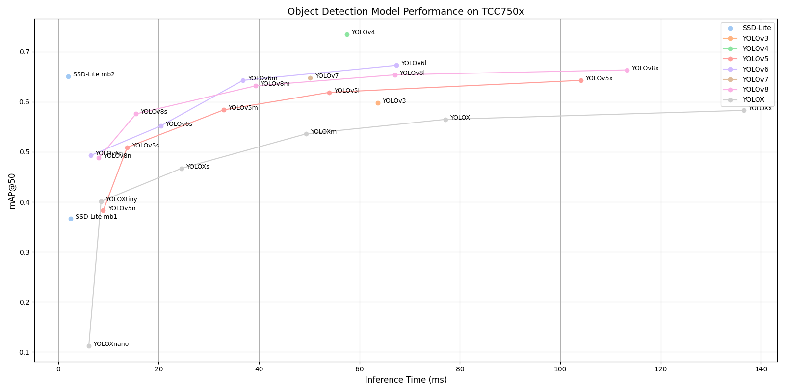

# YOLO Series Benchmark on TCC750X

Below is benchmark data for various **YOLO (You Only Look Once)** object detection models running on the **TCC750X (N-Dolphin)** platform.  
YOLO models are widely known for their real-time performance and high accuracy in detecting multiple objects in a single pass over the image.  
This benchmark covers multiple YOLO versions (v3 ~ v8, YOLOX, YOLOv6, etc.), providing insight into their speed and detection accuracy on embedded hardware.

Clicking on a model name in the table allows you to download the binary, ready to run on the TCC750X board.

---

### 📊 How to Read the Table Below

| Column                    | Description                                                                 |
|--------------------------|-----------------------------------------------------------------------------|
| **Model**                | Name of the neural network model     |
| **Framework**            | Deep learning framework used (e.g., PyTorch, TFLite, ONNX)                  |
| **Dataset**              | Evaluation dataset (COCO val2017 or VOC2007 test set)                       |
| **Input Size (WxHxC)**   | Model input resolution and channel configuration                            |
| **Quantization Bit**     | Bit-depth used for quantization (e.g., INT8)                                |
| **Binary Files Info.**   | Size of the compiled neural network binaries for TCC750X                    |
| **Inference Time (ms)**  | Inference time measured on the N-Dolphin EVB using zero-padded input images.                               |
| **mAP@50-95**             | mAP (mean Average Precision) is evaluated on the **COCO val2017 dataset** (5,000 images) or the **VOC2007 test dataset** (4,952 images).                    |
| **References**           | Link to the original GitHub repository of the model                         |

---

<!--
아래는 TCC750X에서 실행되는 Object Detection 모델의 벤치마크 자료입니다.
이 표를 통해 각 신경망이 N-Dolphin (TCC750X) 보드에서 실행될 때의 성능을 확인할 수 있습니다.
또한, 신경망 이름을 클릭하면 해당 보드에서 실행할 수 있는 형식의 결과물을 다운로드할 수 있습니다.

참조사항
Detections/Dataset: COCO
Evaluation: tc-nn-toolkit을 이용하여 측정한 결과입니다.
- Evaluation Result의 FP32: .enlight 확장자로 변환된 상태에서 측정된 값입니다.
Inference Time: N-Dolphin EVB에서 실행한 결과입니다.
Reference: 신경망 모델의 원본 GitHub 링크로 연결됩니다.
-->

<table border="1" cellspacing="0" cellpadding="5">
    <thead>
        <tr>
            <th align="center" rowspan="2" colspan="2">Model</th>
            <th rowspan="2">Framework</th>
            <th rowspan="2">Dataset</th>
            <th rowspan="2">Input Size (WxHxC)</th>
            <th rowspan="2">Quantization Bit</th>
            <th colspan="2">Binary Files Info.</th>
            <th rowspan="2">Inference Time(ms)</th>
            <th colspan="2">mAP@50-95</th>
            <th rowspan="2">References</th>
        </tr>
        <tr>
            <th>Weight & Bias Bin.(MB)</th>
            <th>Command Bin.(KB)</th>
            <th>FP32</th>
            <th>INT8</th>
        </tr>
    </thead>
    <tbody>
        <tr>
            <td align="center" colspan="2"><a href="Yolo/yolov3/">YOLOv3</a></td> <!-- Model -->
            <td align="center">Pytorch</td> <!-- Framework -->
            <td align="center">COCO</td> <!-- Detections/DataSet -->
            <td align="center">640x640x3</td> <!-- Input Size (WxHxC) -->
            <td align="center">INT8</td> <!-- Quantization Bit -->
            <td align="center">60</td> <!-- Compiled NN Information: Weight, Bias Binary Size(MB) -->
            <td align="center">232</td> <!-- Compiled NN Information: Command Binary Size(KB) -->
            <td align="center">66.3</td> <!-- Inference Time(msec): EVB -->
            <td align="center">0.439</td> <!-- Evaluation Result: FP32 -->
            <td align="center">0.386</td> <!-- Evaluation Result: INT8 -->
            <td align="center"><a href="https://github.com/ultralytics/yolov3">GitHub<a></td> <!-- References: Link -->
        </tr>
        <tr>
            <td align="center" colspan="2"><a href="Yolo/yolov4/">YOLOv4</a></td> <!-- Model -->
            <td align="center">Darknet</td> <!-- Framework -->
            <td align="center">COCO</td> <!-- Detections/DataSet -->
            <td align="center">608x608x3</td> <!-- Input Size (WxHxC) -->
            <td align="center">INT8</td> <!-- Quantization Bit -->
            <td align="center">62</td> <!-- Compiled NN Information: Weight, Bias Binary Size(MB) -->
            <td align="center">308</td> <!-- Compiled NN Information: Command Binary Size(KB) -->
            <td align="center">60.14</td> <!-- Inference Time(msec): EVB -->
            <td align="center">0.501</td> <!-- Evaluation Result: FP32 -->
            <td align="center">0.402</td> <!-- Evaluation Result: INT8 -->
            <td align="center"><a href="https://github.com/AlexeyAB/darknet/blob/master/cfg/yolov4.cfg">Github<a></td> <!-- References: Link -->
        </tr>
        <tr>
            <td align="center" rowspan="5" class="model">YOLOv5</td> <!-- Model -->
            <td align="center" class="variant"><a href="Yolo/yolov5/yolov5n/">n</a></td>
            <td align="center">Pytorch</td> <!-- Framework -->
            <td align="center">COCO</td> <!-- Detections/DataSet -->
            <td align="center">640x640x3</td> <!-- Input Size (WxHxC) -->
            <td align="center">INT8</td> <!-- Quantization Bit -->
            <td align="center">2</td> <!-- Compiled NN Information: Weight, Bias Binary Size(MB) -->
            <td align="center">80</td> <!-- Compiled NN Information: Command Binary Size(KB) -->
            <td align="center">9.38</td> <!-- Inference Time(msec): EVB -->
            <td align="center">0.246</td> <!-- Evaluation Result: FP32 -->
            <td align="center">0.213</td> <!-- Evaluation Result: INT8 -->
            <td align="center" rowspan="5"><a href="https://github.com/ultralytics/yolov5">GitHub<a></td> <!-- References: Link -->
        </tr>
        <tr>
            <td align="center" class="variant"><a href="Yolo/yolov5/yolov5s/">s</a></td> <!-- Model -->
            <td align="center">Pytorch</td> <!-- Framework -->
            <td align="center">COCO</td> <!-- Detections/DataSet -->
            <td align="center">640x640x3</td> <!-- Input Size (WxHxC) -->
            <td align="center">INT8</td> <!-- Quantization Bit -->
            <td align="center">7</td> <!-- Compiled NN Information: Weight, Bias Binary Size(MB) -->
            <td align="center">144</td> <!-- Compiled NN Information: Command Binary Size(KB) -->
            <td align="center">14.7</td> <!-- Inference Time(msec): EVB -->
            <td align="center">0.342</td> <!-- Evaluation Result: FP32 -->
            <td align="center">0.303</td> <!-- Evaluation Result: INT8 -->
        </tr>
        <tr>
            <td align="center" class="variant"><a href="Yolo/yolov5/yolov5m/">m</a></td> <!-- Model -->
            <td align="center">Pytorch</td> <!-- Framework -->
            <td align="center">COCO</td> <!-- Detections/DataSet -->
            <td align="center">640x640x3</td> <!-- Input Size (WxHxC) -->
            <td align="center">INT8</td> <!-- Quantization Bit -->
            <td align="center">21</td> <!-- Compiled NN Information: Weight, Bias Binary Size(MB) -->
            <td align="center">188</td> <!-- Compiled NN Information: Command Binary Size(KB) -->
            <td align="center">34.9</td> <!-- Inference Time(msec): EVB -->
            <td align="center">0.424</td> <!-- Evaluation Result: FP32 -->
            <td align="center">0.385</td> <!-- Evaluation Result: INT8 -->
        </tr>
        <tr>
            <td align="center" class="variant"><a href="Yolo/yolov5/yolov5l/">l</a></td> <!-- Model -->
            <td align="center">Pytorch</td> <!-- Framework -->
            <td align="center">COCO</td> <!-- Detections/DataSet -->
            <td align="center">640x640x3</td> <!-- Input Size (WxHxC) -->
            <td align="center">INT8</td> <!-- Quantization Bit -->
            <td align="center">45</td> <!-- Compiled NN Information: Weight, Bias Binary Size(MB) -->
            <td align="center">308</td> <!-- Compiled NN Information: Command Binary Size(KB) -->
            <td align="center">55.17</td> <!-- Inference Time(msec): EVB -->
            <td align="center">0.461</td> <!-- Evaluation Result: FP32 -->
            <td align="center">0.406</td> <!-- Evaluation Result: INT8 -->
        </tr>
        <tr>
            <td align="center" class="variant"><a href="Yolo/yolov5/yolov5x/">x</a></td> <!-- Model -->
            <td align="center">Pytorch</td> <!-- Framework -->
            <td align="center">COCO</td> <!-- Detections/DataSet -->
            <td align="center">640x640x3</td> <!-- Input Size (WxHxC) -->
            <td align="center">INT8</td> <!-- Quantization Bit -->
            <td align="center">83</td> <!-- Compiled NN Information: Weight, Bias Binary Size(MB) -->
            <td align="center">460</td> <!-- Compiled NN Information: Command Binary Size(KB) -->
            <td align="center">107.53</td> <!-- Inference Time(msec): EVB -->
            <td align="center">0.478</td> <!-- Evaluation Result: FP32 -->
            <td align="center">0.437</td> <!-- Evaluation Result: INT8 -->
        </tr>
        <tr>
            <td align="center" rowspan="4" class="model">YOLOv6</td> <!-- Model -->
            <td align="center" class="variant"><a href="Yolo/yolov6/yolov6n/">n</a></td> <!-- Models: Variant -->
            <td align="center">Pytorch</td> <!-- Framework -->
            <td align="center">COCO</td> <!-- Detections/DataSet -->
            <td align="center">640x640x3</td> <!-- Input Size (WxHxC) -->
            <td align="center">INT8</td> <!-- Quantization Bit -->
            <td align="center">5</td> <!-- Compiled NN Information: Weight, Bias Binary Size(MB) -->
            <td align="center">40</td> <!-- Compiled NN Information: Command Binary Size(KB) -->
            <td align="center">6.75</td> <!-- Inference Time(msec): EVB -->
            <td align="center">0.353</td> <!-- Evaluation Result: FP32 -->
            <td align="center">0.332</td> <!-- Evaluation Result: INT8 -->
            <td align="center" rowspan="4"><a href="https://github.com/meituan/YOLOv6">GitHub<a></td> <!-- References: Link -->
        </tr>
        <tr>
            <td align="center" class="variant"><a href="Yolo/yolov6/yolov6s/">s</a></td> <!-- Model -->
            <td align="center">Pytorch</td> <!-- Framework -->
            <td align="center">COCO</td> <!-- Detections/DataSet -->
            <td align="center">640x640x3</td> <!-- Input Size (WxHxC) -->
            <td align="center">INT8</td> <!-- Quantization Bit -->
            <td align="center">18</td> <!-- Compiled NN Information: Weight, Bias Binary Size(MB) -->
            <td align="center">84</td> <!-- Compiled NN Information: Command Binary Size(KB) -->
            <td align="center">20.96</td> <!-- Inference Time(msec): EVB -->
            <td align="center">0.422</td> <!-- Evaluation Result: FP32 -->
            <td align="center">0.384</td> <!-- Evaluation Result: INT8 -->
        </tr>
        <tr>
            <td align="center" class="variant"><a href="Yolo/yolov6/yolov6m/">m</a></td> <!-- Model -->
            <td align="center">Pytorch</td> <!-- Framework -->
            <td align="center">COCO</td> <!-- Detections/DataSet -->
            <td align="center">640x640x3</td> <!-- Input Size (WxHxC) -->
            <td align="center">INT8</td> <!-- Quantization Bit -->
            <td align="center">34</td> <!-- Compiled NN Information: Weight, Bias Binary Size(MB) -->
            <td align="center">116</td> <!-- Compiled NN Information: Command Binary Size(KB) -->
            <td align="center">37.96</td> <!-- Inference Time(msec): EVB -->
            <td align="center">0.468</td> <!-- Evaluation Result: FP32 -->
            <td align="center">0.462</td> <!-- Evaluation Result: INT8 -->
        </tr>
        <tr>
            <td align="center" class="variant"><a href="Yolo/yolov6/yolov6l/">l</a></td> <!-- Model -->
            <td align="center">Pytorch</td> <!-- Framework -->
            <td align="center">COCO</td> <!-- Detections/DataSet -->
            <td align="center">640x640x3</td> <!-- Input Size (WxHxC) -->
            <td align="center">INT8</td> <!-- Quantization Bit -->
            <td align="center">57</td> <!-- Compiled NN Information: Weight, Bias Binary Size(MB) -->
            <td align="center">240</td> <!-- Compiled NN Information: Command Binary Size(KB) -->
            <td align="center">69.06</td> <!-- Inference Time(msec): EVB -->
            <td align="center">0.496</td> <!-- Evaluation Result: FP32 -->
            <td align="center">0.489</td> <!-- Evaluation Result: INT8 -->
        </tr>
        <tr>
            <td align="center" colspan="2"><a href="Yolo/yolov7/">YOLOv7</a></td> <!-- Model -->
            <td align="center">Pytorch</td> <!-- Framework -->
            <td align="center">COCO</td> <!-- Detections/DataSet -->
            <td align="center">640x640x3</td> <!-- Input Size (WxHxC) -->
            <td align="center">INT8</td> <!-- Quantization Bit -->
            <td align="center">36</td> <!-- Compiled NN Information: Weight, Bias Binary Size(MB) -->
            <td align="center">244</td> <!-- Compiled NN Information: Command Binary Size(KB) -->
            <td align="center">55.0</td> <!-- Inference Time(msec): EVB -->
            <td align="center">0.479</td> <!-- Evaluation Result: FP32 -->
            <td align="center">0.421</td> <!-- Evaluation Result: INT8 -->
            <td align="center"><a href="https://github.com/WongKinYiu/yolov7">GitHub<a></td> <!-- References: Link -->
        </tr>
        <tr>
            <td align="center" rowspan="5" class="model">YOLOv8</td> <!-- Model -->
            <td align="center" class="variant"><a href="Yolo/yolov8/yolov8n/">n</a></td>
            <td align="center">Pytorch</td> <!-- Framework -->
            <td align="center">COCO</td> <!-- Detections/DataSet -->
            <td align="center">640x640x3</td> <!-- Input Size (WxHxC) -->
            <td align="center">INT8</td> <!-- Quantization Bit -->
            <td align="center">4</td> <!-- Compiled NN Information: Weight, Bias Binary Size(MB) -->
            <td align="center">72</td> <!-- Compiled NN Information: Command Binary Size(KB) -->
            <td align="center">8.63</td> <!-- Inference Time(msec): EVB -->
            <td align="center">0.344</td> <!-- Evaluation Result: FP32 -->
            <td align="center">0.364</td> <!-- Evaluation Result: INT8 -->
            <td align="center" rowspan="5"><a href="https://github.com/ultralytics/ultralytics">GitHub<a></td> <!-- References: Link -->
        </tr>
        <tr>
            <td align="center" class="variant"><a href="Yolo/yolov8/yolov8s/">s</a></td> <!-- Model -->
            <td align="center">Pytorch</td> <!-- Framework -->
            <td align="center">COCO</td> <!-- Detections/DataSet -->
            <td align="center">640x640x3</td> <!-- Input Size (WxHxC) -->
            <td align="center">INT8</td> <!-- Quantization Bit -->
            <td align="center">11</td> <!-- Compiled NN Information: Weight, Bias Binary Size(MB) -->
            <td align="center">92</td> <!-- Compiled NN Information: Command Binary Size(KB) -->
            <td align="center">16.17</td> <!-- Inference Time(msec): EVB -->
            <td align="center">0.459</td> <!-- Evaluation Result: FP32 -->
            <td align="center">0.442</td> <!-- Evaluation Result: INT8 -->
        </tr>
        <tr>
            <td align="center" class="variant"><a href="Yolo/yolov8/yolov8m/">m</a></td> <!-- Model -->
            <td align="center">Pytorch</td> <!-- Framework -->
            <td align="center">COCO</td> <!-- Detections/DataSet -->
            <td align="center">640x640x3</td> <!-- Input Size (WxHxC) -->
            <td align="center">INT8</td> <!-- Quantization Bit -->
            <td align="center">25</td> <!-- Compiled NN Information: Weight, Bias Binary Size(MB) -->
            <td align="center">156</td> <!-- Compiled NN Information: Command Binary Size(KB) -->
            <td align="center">45.35</td> <!-- Inference Time(msec): EVB -->
            <td align="center">0.472</td> <!-- Evaluation Result: FP32 -->
            <td align="center">0.458</td> <!-- Evaluation Result: INT8 -->
        </tr>
        <tr>
            <td align="center" class="variant"><a href="Yolo/yolov8/yolov8l/">l</a></td> <!-- Model -->
            <td align="center">Pytorch</td> <!-- Framework -->
            <td align="center">COCO</td> <!-- Detections/DataSet -->
            <td align="center">640x640x3</td> <!-- Input Size (WxHxC) -->
            <td align="center">INT8</td> <!-- Quantization Bit -->
            <td align="center">42</td> <!-- Compiled NN Information: Weight, Bias Binary Size(MB) -->
            <td align="center">248</td> <!-- Compiled NN Information: Command Binary Size(KB) -->
            <td align="center">69.16</td> <!-- Inference Time(msec): EVB -->
            <td align="center">0.544</td> <!-- Evaluation Result: FP32 -->
            <td align="center">0.529</td> <!-- Evaluation Result: INT8 -->
        </tr>
        <tr>
            <td align="center" class="variant"><a href="Yolo/yolov8/yolov8x/">x</a></td> <!-- Model -->
            <td align="center">Pytorch</td> <!-- Framework -->
            <td align="center">COCO</td> <!-- Detections/DataSet -->
            <td align="center">640x640x3</td> <!-- Input Size (WxHxC) -->
            <td align="center">INT8</td> <!-- Quantization Bit -->
            <td align="center">66</td> <!-- Compiled NN Information: Weight, Bias Binary Size(MB) -->
            <td align="center">436</td> <!-- Compiled NN Information: Command Binary Size(KB) -->
            <td align="center">118.06</td> <!-- Inference Time(msec): EVB -->
            <td align="center">0.559</td> <!-- Evaluation Result: FP32 -->
            <td align="center">0.540</td> <!-- Evaluation Result: INT8 -->
        </tr>
        <tr>
            <td align="center" rowspan="6" class="model">YOLOX</td> <!-- Model -->
            <td align="center" class="variant"><a href="Yolo/yoloX/yolox_s/">s</a></td> <!-- Model -->
            <td align="center">Pytorch</td> <!-- Framework -->
            <td align="center">COCO</td> <!-- Detections/DataSet -->
            <td align="center">640x640x3</td> <!-- Input Size (WxHxC) -->
            <td align="center">INT8</td> <!-- Quantization Bit -->
            <td align="center">9</td> <!-- Compiled NN Information: Weight, Bias Binary Size(MB) -->
            <td align="center">188</td> <!-- Compiled NN Information: Command Binary Size(KB) -->
            <td align="center">26.29</td> <!-- Inference Time(msec): EVB -->
            <td align="center">0.355</td> <!-- Evaluation Result: FP32 -->
            <td align="center">0.350</td> <!-- Evaluation Result: INT8 -->
            <td align="center" rowspan="6"><a href="https://github.com/Megvii-BaseDetection/YOLOX">GitHub<a></td> <!-- References: Link -->
        </tr>
        <tr>
            <td align="center" class="variant"><a href="Yolo/yoloX/yolox_m/">m</a></td> <!-- Model -->
            <td align="center">Pytorch</td> <!-- Framework -->
            <td align="center">COCO</td> <!-- Detections/DataSet -->
            <td align="center">640x640x3</td> <!-- Input Size (WxHxC) -->
            <td align="center">INT8</td> <!-- Quantization Bit -->
            <td align="center">25</td> <!-- Compiled NN Information: Weight, Bias Binary Size(MB) -->
            <td align="center">236</td> <!-- Compiled NN Information: Command Binary Size(KB) -->
            <td align="center">52.79</td> <!-- Inference Time(msec): EVB -->
            <td align="center">0.424</td> <!-- Evaluation Result: FP32 -->
            <td align="center">0.371</td> <!-- Evaluation Result: INT8 -->
        </tr>
        <tr>
            <td align="center" class="variant"><a href="Yolo/yoloX/yolox_l/">l</a></td> <!-- Model -->
            <td align="center">Pytorch</td> <!-- Framework -->
            <td align="center">COCO</td> <!-- Detections/DataSet -->
            <td align="center">640x640x3</td> <!-- Input Size (WxHxC) -->
            <td align="center">INT8</td> <!-- Quantization Bit -->
            <td align="center">52</td> <!-- Compiled NN Information: Weight, Bias Binary Size(MB) -->
            <td align="center">372</td> <!-- Compiled NN Information: Command Binary Size(KB) -->
            <td align="center">79.72</td> <!-- Inference Time(msec): EVB -->
            <td align="center">0.450</td> <!-- Evaluation Result: FP32 -->
            <td align="center">0.442</td> <!-- Evaluation Result: INT8 -->
        </tr>
        <tr>
            <td align="center" class="variant"><a href="Yolo/yoloX/yolox_x/">x</a></td> <!-- Model -->
            <td align="center">Pytorch</td> <!-- Framework -->
            <td align="center">COCO</td> <!-- Detections/DataSet -->
            <td align="center">640x640x3</td> <!-- Input Size (WxHxC) -->
            <td align="center">INT8</td> <!-- Quantization Bit -->
            <td align="center">95</td> <!-- Compiled NN Information: Weight, Bias Binary Size(MB) -->
            <td align="center">560</td> <!-- Compiled NN Information: Command Binary Size(KB) -->
            <td align="center">141.12</td> <!-- Inference Time(msec): EVB -->
            <td align="center">0.432</td> <!-- Evaluation Result: FP32 -->
            <td align="center">0.418</td> <!-- Evaluation Result: INT8 -->
        </tr>
        <tr>
            <td align="center" class="variant"><a href="Yolo/yoloX/yolox_tiny/">tiny</a></td> <!-- Model -->
            <td align="center">Pytorch</td> <!-- Framework -->
            <td align="center">COCO</td> <!-- Detections/DataSet -->
            <td align="center">416x416x3</td> <!-- Input Size (WxHxC) -->
            <td align="center">INT8</td> <!-- Quantization Bit -->
            <td align="center">5</td> <!-- Compiled NN Information: Weight, Bias Binary Size(MB) -->
            <td align="center">64</td> <!-- Compiled NN Information: Command Binary Size(KB) -->
            <td align="center">9.26</td> <!-- Inference Time(msec): EVB -->
            <td align="center">0.287</td> <!-- Evaluation Result: FP32 -->
            <td align="center">0.277</td> <!-- Evaluation Result: INT8 -->
        </tr>
        <tr>
            <td align="center" class="variant"><a href="Yolo/yoloX/yolox_nano/">nano</a></td> <!-- Model -->
            <td align="center">Pytorch</td> <!-- Framework -->
            <td align="center">COCO</td> <!-- Detections/DataSet -->
            <td align="center">416x416x3</td> <!-- Input Size (WxHxC) -->
            <td align="center">INT8</td> <!-- Quantization Bit -->
            <td align="center">1</td> <!-- Compiled NN Information: Weight, Bias Binary Size(MB) -->
            <td align="center">64</td> <!-- Compiled NN Information: Command Binary Size(KB) -->
            <td align="center">6.71</td> <!-- Inference Time(msec): EVB -->
            <td align="center">0.209</td> <!-- Evaluation Result: FP32 -->
            <td align="center">0.069</td> <!-- Evaluation Result: INT8 -->
        </tr>
    </tbody>
</table>

## 📤 Output Format

- The output of YOLO models is a set of **bounding boxes** with associated class predictions and confidence scores.
- Each detection includes the following information:
  - **(x, y, w, h)**: Bounding box center coordinates, width, and height (normalized or absolute, depending on the model).
  - **Objectness score**: Confidence that an object exists in the box.
  - **Class probabilities**: Confidence scores for each class.
  - **Final score**: Typically computed as `objectness × class probability`.

- After post-processing (e.g., **Non-Maximum Suppression**), the model returns a list of **top-k detected objects** in the image, each including:
  - Bounding box coordinates
  - Class label
  - Confidence score

- The number and format of output tensors may vary slightly depending on the YOLO version (e.g., v5, v6, v8, YOLOX), but the core structure remains similar.