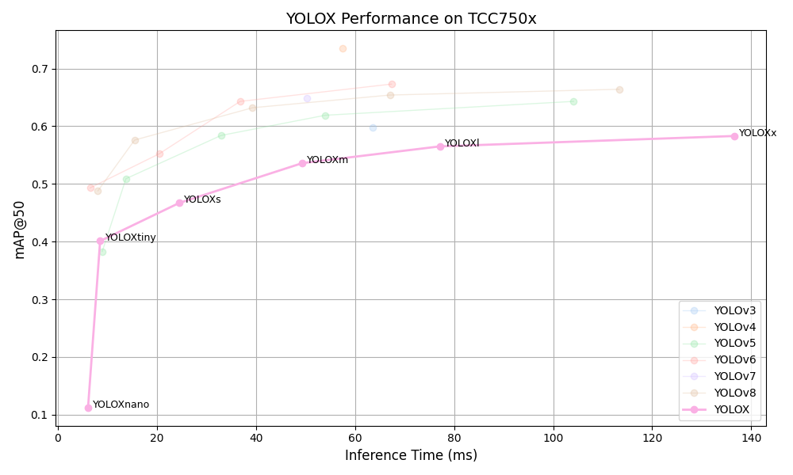

# YOLOX Benchmark on TCC750x

<table border="1" cellspacing="0" cellpadding="5">
    <thead>
        <tr>
            <th align="center" rowspan="2" colspan="2">Model</th>
            <th th align="center" rowspan="2">Framework</th>
            <th th align="center" rowspan="2">Dataset</th>
            <th th align="center" rowspan="2">Input Size (WxHxC)</th>
            <th th align="center" rowspan="2">Quantization Bit</th>
            <th th align="center" colspan="2">Binary Files Info.</th>
            <th th align="center" rowspan="2">Inference Time(ms)</th>
            <th th align="center" colspan="2">mAP@50-95</th>
            <th th align="center" colspan="2">mAP@50</th>
            <th th align="center" rowspan="2">References</th>
        </tr>
        <tr>
            <th>Weight and Bias Binary (MB)</th>
            <th>Command Binary (KB)</th>
            <th>FP32</th>
            <th>INT8</th>
            <th>FP32</th>
            <th>INT8</th>
        </tr>
    </thead>
    <tbody>
        <tr>
            <td align="center" rowspan="6" class="model">YOLOX</td> <!-- Model -->
            <td align="center" class="variant"><a href="Yolo/yoloX/yolox_s/">s</a></td> <!-- Model -->
            <td align="center">PyTorch</td> <!-- Framework -->
            <td align="center">COCO</td> <!-- Detections/DataSet -->
            <td align="center">640x640x3</td> <!-- Input Size (WxHxC) -->
            <td align="center">INT8</td> <!-- Quantization Bit -->
            <td align="center">9</td> <!-- Compiled NN Information: Weight, Bias Binary Size(MB) -->
            <td align="center">188</td> <!-- Compiled NN Information: Command Binary Size(KB) -->
            <td align="center">26.29</td> <!-- Inference Time(msec): EVB -->
            <td align="center">0.316</td> <!-- Evaluation Result: FP32 IoU=0.50:0.95 -->
            <td align="center">0.308</td> <!-- Evaluation Result: INT8 IoU=0.50:0.95 -->
            <td align="center">0.473</td> <!-- Evaluation Result: FP32 IoU=0.50 -->
            <td align="center">0.467</td> <!-- Evaluation Result: INT8 IoU=0.50 -->
            <td align="center" rowspan="6"><a href="https://github.com/Megvii-BaseDetection/YOLOX">GitHub<a></td> <!-- References: Link -->
        </tr>
        <tr>
            <td align="center" class="variant"><a href="Yolo/yoloX/yolox_m/">m</a></td> <!-- Model -->
            <td align="center">PyTorch</td> <!-- Framework -->
            <td align="center">COCO</td> <!-- Detections/DataSet -->
            <td align="center">640x640x3</td> <!-- Input Size (WxHxC) -->
            <td align="center">INT8</td> <!-- Quantization Bit -->
            <td align="center">25</td> <!-- Compiled NN Information: Weight, Bias Binary Size(MB) -->
            <td align="center">236</td> <!-- Compiled NN Information: Command Binary Size(KB) -->
            <td align="center">52.79</td> <!-- Inference Time(msec): EVB -->
            <td align="center">0.382</td> <!-- Evaluation Result: FP32 IoU=0.50:0.95 -->
            <td align="center">0.371</td> <!-- Evaluation Result: INT8 IoU=0.50:0.95 -->
            <td align="center">0.542</td> <!-- Evaluation Result: FP32 IoU=0.50 -->
            <td align="center">0.536</td> <!-- Evaluation Result: INT8 IoU=0.50 -->
        </tr>
        <tr>
            <td align="center" class="variant"><a href="Yolo/yoloX/yolox_l/">l</a></td> <!-- Model -->
            <td align="center">PyTorch</td> <!-- Framework -->
            <td align="center">COCO</td> <!-- Detections/DataSet -->
            <td align="center">640x640x3</td> <!-- Input Size (WxHxC) -->
            <td align="center">INT8</td> <!-- Quantization Bit -->
            <td align="center">52</td> <!-- Compiled NN Information: Weight, Bias Binary Size(MB) -->
            <td align="center">372</td> <!-- Compiled NN Information: Command Binary Size(KB) -->
            <td align="center">79.72</td> <!-- Inference Time(msec): EVB -->
            <td align="center">0.414</td> <!-- Evaluation Result: FP32 IoU=0.50:0.95 -->
            <td align="center">0.403</td> <!-- Evaluation Result: INT8 IoU=0.50:0.95 -->
            <td align="center">0.572</td> <!-- Evaluation Result: FP32 IoU=0.50 -->
            <td align="center">0.565</td> <!-- Evaluation Result: INT8 IoU=0.50 -->
        </tr>
        <tr>
            <td align="center" class="variant"><a href="Yolo/yoloX/yolox_x/">x</a></td> <!-- Model -->
            <td align="center">PyTorch</td> <!-- Framework -->
            <td align="center">COCO</td> <!-- Detections/DataSet -->
            <td align="center">640x640x3</td> <!-- Input Size (WxHxC) -->
            <td align="center">INT8</td> <!-- Quantization Bit -->
            <td align="center">95</td> <!-- Compiled NN Information: Weight, Bias Binary Size(MB) -->
            <td align="center">560</td> <!-- Compiled NN Information: Command Binary Size(KB) -->
            <td align="center">141.12</td> <!-- Inference Time(msec): EVB -->
            <td align="center">0.432</td> <!-- Evaluation Result: FP32 IoU=0.50:0.95 -->
            <td align="center">0.418</td> <!-- Evaluation Result: INT8 IoU=0.50:0.95 -->
            <td align="center">0.591</td> <!-- Evaluation Result: FP32 IoU=0.50 -->
            <td align="center">0.583</td> <!-- Evaluation Result: INT8 IoU=0.50 -->
        </tr>
        <tr>
            <td align="center" class="variant"><a href="Yolo/yoloX/yolox_tiny/">tiny</a></td> <!-- Model -->
            <td align="center">PyTorch</td> <!-- Framework -->
            <td align="center">COCO</td> <!-- Detections/DataSet -->
            <td align="center">416x416x3</td> <!-- Input Size (WxHxC) -->
            <td align="center">INT8</td> <!-- Quantization Bit -->
            <td align="center">5</td> <!-- Compiled NN Information: Weight, Bias Binary Size(MB) -->
            <td align="center">64</td> <!-- Compiled NN Information: Command Binary Size(KB) -->
            <td align="center">9.26</td> <!-- Inference Time(msec): EVB -->
            <td align="center">0.265</td> <!-- Evaluation Result: FP32 IoU=0.50:0.95 -->
            <td align="center">0.255</td> <!-- Evaluation Result: INT8 IoU=0.50:0.95 -->
            <td align="center">0.411</td> <!-- Evaluation Result: FP32 IoU=0.50 -->
            <td align="center">0.401</td> <!-- Evaluation Result: INT8 IoU=0.50 -->
        </tr>
        <tr>
            <td align="center" class="variant"><a href="Yolo/yoloX/yolox_nano/">nano</a></td> <!-- Model -->
            <td align="center">PyTorch</td> <!-- Framework -->
            <td align="center">COCO</td> <!-- Detections/DataSet -->
            <td align="center">416x416x3</td> <!-- Input Size (WxHxC) -->
            <td align="center">INT8</td> <!-- Quantization Bit -->
            <td align="center">1</td> <!-- Compiled NN Information: Weight, Bias Binary Size(MB) -->
            <td align="center">64</td> <!-- Compiled NN Information: Command Binary Size(KB) -->
            <td align="center">6.71</td> <!-- Inference Time(msec): EVB -->
            <td align="center">0.201</td> <!-- Evaluation Result: FP32 IoU=0.50:0.95 -->
            <td align="center">0.063</td> <!-- Evaluation Result: INT8 IoU=0.50:0.95 -->
            <td align="center">0.326</td> <!-- Evaluation Result: FP32 IoU=0.50 -->
            <td align="center">0.112</td> <!-- Evaluation Result: INT8 IoU=0.50 -->
        </tr>
    </tbody>
</table>