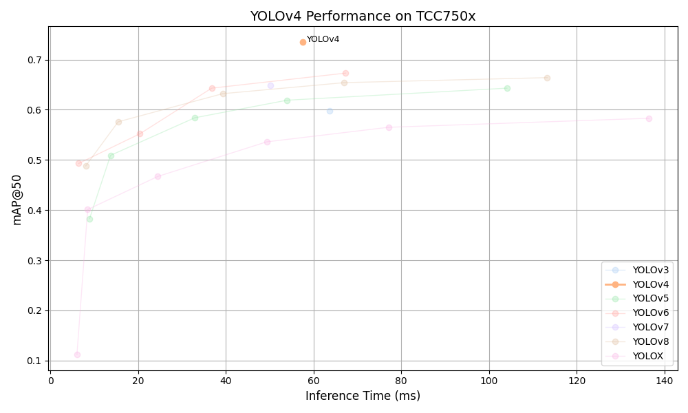

# YOLOv4 Benchmark on TCC750x

<table border="1" cellspacing="0" cellpadding="5">
    <thead>
        <tr>
            <th align="center" rowspan="2" colspan="2">Model</th>
            <th th align="center" rowspan="2">Framework</th>
            <th th align="center" rowspan="2">Dataset</th>
            <th th align="center" rowspan="2">Input Size (WxHxC)</th>
            <th th align="center" rowspan="2">Quantization Bit</th>
            <th th align="center" colspan="2">Binary Files Information</th>
            <th th align="center" rowspan="2">Inference Time (ms)</th>
            <th th align="center" colspan="2">mAP@50:95</th>
            <th th align="center" colspan="2">mAP@50</th>
            <th th align="center" rowspan="2">References</th>
        </tr>
        <tr>
            <th>Weight and Bias Binary (MB)</th>
            <th>Command Binary (KB)</th>
            <th>FP32</th>
            <th>INT8</th>
            <th>FP32</th>
            <th>INT8</th>
        </tr>
    </thead>
    <tbody>
        <tr>
            <td align="center" colspan="2">YOLOv4</td> <!-- Model -->
            <td align="center">Darknet</td> <!-- Framework -->
            <td align="center">COCO</td> <!-- Detections/DataSet -->
            <td align="center">608x608x3</td> <!-- Input Size (WxHxC) -->
            <td align="center">INT8</td> <!-- Quantization Bit -->
            <td align="center">62</td> <!-- Compiled NN Information: Weight, Bias Binary Size(MB) -->
            <td align="center">308</td> <!-- Compiled NN Information: Command Binary Size(KB) -->
            <td align="center">60.14</td> <!-- Inference Time(msec): EVB -->
            <td align="center">0.501</td> <!-- Evaluation Result: FP32 IoU=0.50:0.95 -->
            <td align="center">0.402</td> <!-- Evaluation Result: INT8 IoU=0.50:0.95 -->
            <td align="center">0.748</td> <!-- Evaluation Result: FP32 IoU=0.50 -->
            <td align="center">0.735</td> <!-- Evaluation Result: INT8 IoU=0.50 -->
            <td align="center"><a href="https://github.com/AlexeyAB/darknet/blob/master/cfg/yolov4.cfg">Github<a></td> <!-- References: Link -->
        </tr>
    </tbody>
</table>
