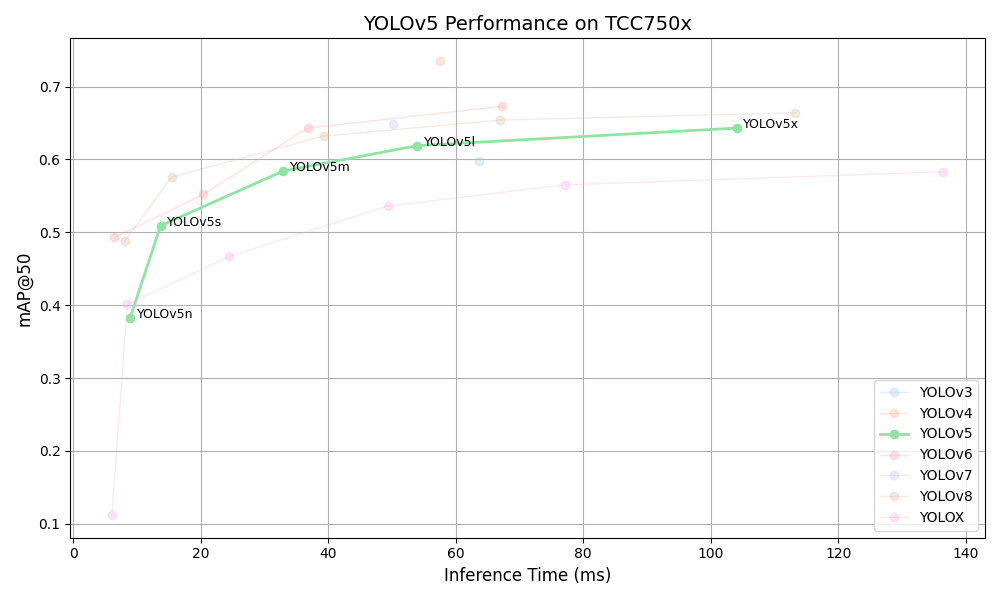

# YOLOv5 Benchmark on TCC750x

<table border="1" cellspacing="0" cellpadding="5">
    <thead>
        <tr>
            <th align="center" rowspan="2" colspan="2">Model</th>
            <th th align="center" rowspan="2">Framework</th>
            <th th align="center" rowspan="2">Dataset</th>
            <th th align="center" rowspan="2">Input Size (WxHxC)</th>
            <th th align="center" rowspan="2">Quantization Bit</th>
            <th th align="center" colspan="2">Binary Files Info.</th>
            <th th align="center" rowspan="2">Inference Time(ms)</th>
            <th th align="center" colspan="2">mAP@50-95</th>
            <th th align="center" colspan="2">mAP@50</th>
            <th th align="center" rowspan="2">References</th>
        </tr>
        <tr>
            <th>Weight and Bias Binary (MB)</th>
            <th>Command Binary (KB)</th>
            <th>FP32</th>
            <th>INT8</th>
            <th>FP32</th>
            <th>INT8</th>
        </tr>
    </thead>
    <tbody>
        <tr>
            <td align="center" rowspan="5" class="model">YOLOv5</td> <!-- Model -->
            <td align="center" class="variant">n</td>
            <td align="center">PyTorch</td> <!-- Framework -->
            <td align="center">COCO</td> <!-- Detections/DataSet -->
            <td align="center">640x640x3</td> <!-- Input Size (WxHxC) -->
            <td align="center">INT8</td> <!-- Quantization Bit -->
            <td align="center">2</td> <!-- Compiled NN Information: Weight, Bias Binary Size(MB) -->
            <td align="center">80</td> <!-- Compiled NN Information: Command Binary Size(KB) -->
            <td align="center">9.38</td> <!-- Inference Time(msec): EVB -->
            <td align="center">0.246</td> <!-- Evaluation Result: FP32 IoU=0.50:0.95 -->
            <td align="center">0.213</td> <!-- Evaluation Result: INT8 IoU=0.50:0.95 -->
            <td align="center">0.418</td> <!-- Evaluation Result: FP32 IoU=0.50 -->
            <td align="center">0.383</td> <!-- Evaluation Result: INT8 IoU=0.50 -->
            <td align="center" rowspan="5"><a href="https://github.com/ultralytics/yolov5">GitHub<a></td> <!-- References: Link -->
        </tr>
        <tr>
            <td align="center" class="variant">s</td> <!-- Model -->
            <td align="center">PyTorch</td> <!-- Framework -->
            <td align="center">COCO</td> <!-- Detections/DataSet -->
            <td align="center">640x640x3</td> <!-- Input Size (WxHxC) -->
            <td align="center">INT8</td> <!-- Quantization Bit -->
            <td align="center">7</td> <!-- Compiled NN Information: Weight, Bias Binary Size(MB) -->
            <td align="center">144</td> <!-- Compiled NN Information: Command Binary Size(KB) -->
            <td align="center">14.7</td> <!-- Inference Time(msec): EVB -->
            <td align="center">0.342</td> <!-- Evaluation Result: FP32 IoU=0.50:0.95 -->
            <td align="center">0.303</td> <!-- Evaluation Result: INT8 IoU=0.50:0.95 -->
            <td align="center">0.533</td> <!-- Evaluation Result: FP32 IoU=0.50 -->
            <td align="center">0.509</td> <!-- Evaluation Result: INT8 IoU=0.50 -->
        </tr>
        <tr>
            <td align="center" class="variant">m</td> <!-- Model -->
            <td align="center">PyTorch</td> <!-- Framework -->
            <td align="center">COCO</td> <!-- Detections/DataSet -->
            <td align="center">640x640x3</td> <!-- Input Size (WxHxC) -->
            <td align="center">INT8</td> <!-- Quantization Bit -->
            <td align="center">21</td> <!-- Compiled NN Information: Weight, Bias Binary Size(MB) -->
            <td align="center">188</td> <!-- Compiled NN Information: Command Binary Size(KB) -->
            <td align="center">34.9</td> <!-- Inference Time(msec): EVB -->
            <td align="center">0.424</td> <!-- Evaluation Result: FP32 IoU=0.50:0.95 -->
            <td align="center">0.385</td> <!-- Evaluation Result: INT8 IoU=0.50:0.95 -->
            <td align="center">0.610</td> <!-- Evaluation Result: FP32 IoU=0.50 -->
            <td align="center">0.584</td> <!-- Evaluation Result: INT8 IoU=0.50 -->
        </tr>
        <tr>
            <td align="center" class="variant">l</td> <!-- Model -->
            <td align="center">PyTorch</td> <!-- Framework -->
            <td align="center">COCO</td> <!-- Detections/DataSet -->
            <td align="center">640x640x3</td> <!-- Input Size (WxHxC) -->
            <td align="center">INT8</td> <!-- Quantization Bit -->
            <td align="center">45</td> <!-- Compiled NN Information: Weight, Bias Binary Size(MB) -->
            <td align="center">308</td> <!-- Compiled NN Information: Command Binary Size(KB) -->
            <td align="center">55.17</td> <!-- Inference Time(msec): EVB -->
            <td align="center">0.461</td> <!-- Evaluation Result: FP32 IoU=0.50:0.95 -->
            <td align="center">0.406</td> <!-- Evaluation Result: INT8 IoU=0.50:0.95 -->
            <td align="center">0.644</td> <!-- Evaluation Result: FP32 IoU=0.50 -->
            <td align="center">0.619</td> <!-- Evaluation Result: INT8 IoU=0.50 -->
        </tr>
        <tr>
            <td align="center" class="variant">x</td> <!-- Model -->
            <td align="center">PyTorch</td> <!-- Framework -->
            <td align="center">COCO</td> <!-- Detections/DataSet -->
            <td align="center">640x640x3</td> <!-- Input Size (WxHxC) -->
            <td align="center">INT8</td> <!-- Quantization Bit -->
            <td align="center">83</td> <!-- Compiled NN Information: Weight, Bias Binary Size(MB) -->
            <td align="center">460</td> <!-- Compiled NN Information: Command Binary Size(KB) -->
            <td align="center">107.53</td> <!-- Inference Time(msec): EVB -->
            <td align="center">0.478</td> <!-- Evaluation Result: FP32 IoU=0.50:0.95 -->
            <td align="center">0.437</td> <!-- Evaluation Result: INT8 IoU=0.50:0.95 -->
            <td align="center">0.660</td> <!-- Evaluation Result: FP32 IoU=0.50 -->
            <td align="center">0.643</td> <!-- Evaluation Result: INT8 IoU=0.50 -->
        </tr>
    </tbody>
</table>