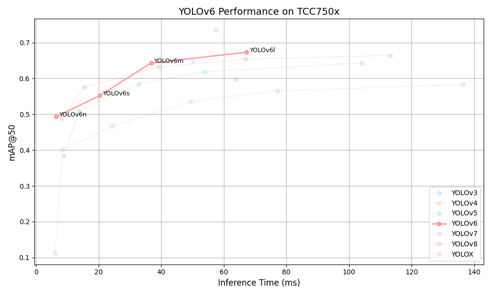

# YOLOv6 Benchmark on TCC750x

<table border="1" cellspacing="0" cellpadding="5">
    <thead>
        <tr>
            <th align="center" rowspan="2" colspan="2">Model</th>
            <th th align="center" rowspan="2">Framework</th>
            <th th align="center" rowspan="2">Dataset</th>
            <th th align="center" rowspan="2">Input Size (WxHxC)</th>
            <th th align="center" rowspan="2">Quantization Bit</th>
            <th th align="center" colspan="2">Binary Files Info.</th>
            <th th align="center" rowspan="2">Inference Time(ms)</th>
            <th th align="center" colspan="2">mAP@50-95</th>
            <th th align="center" colspan="2">mAP@50</th>
            <th th align="center" rowspan="2">References</th>
        </tr>
        <tr>
            <th>Weight and Bias Binary (MB)</th>
            <th>Command Binary (KB)</th>
            <th>FP32</th>
            <th>INT8</th>
            <th>FP32</th>
            <th>INT8</th>
        </tr>
    </thead>
    <tbody>
        <tr>
            <td align="center" rowspan="4" class="model">YOLOv6</td> <!-- Model -->
            <td align="center" class="variant">n</td> <!-- Models: Variant -->
            <td align="center">PyTorch</td> <!-- Framework -->
            <td align="center">COCO</td> <!-- Detections/DataSet -->
            <td align="center">640x640x3</td> <!-- Input Size (WxHxC) -->
            <td align="center">INT8</td> <!-- Quantization Bit -->
            <td align="center">5</td> <!-- Compiled NN Information: Weight, Bias Binary Size(MB) -->
            <td align="center">40</td> <!-- Compiled NN Information: Command Binary Size(KB) -->
            <td align="center">6.75</td> <!-- Inference Time(msec): EVB -->
            <td align="center">0.353</td> <!-- Evaluation Result: FP32 IoU=0.50:0.95 -->
            <td align="center">0.332</td> <!-- Evaluation Result: INT8 IoU=0.50:0.95 -->
            <td align="center">0.514</td> <!-- Evaluation Result: FP32 IoU=0.50 -->
            <td align="center">0.493</td> <!-- Evaluation Result: INT8 IoU=0.50 -->
            <td align="center" rowspan="4"><a href="https://github.com/meituan/YOLOv6">GitHub<a></td> <!-- References: Link -->
        </tr>
        <tr>
            <td align="center" class="variant">s</td> <!-- Model -->
            <td align="center">PyTorch</td> <!-- Framework -->
            <td align="center">COCO</td> <!-- Detections/DataSet -->
            <td align="center">640x640x3</td> <!-- Input Size (WxHxC) -->
            <td align="center">INT8</td> <!-- Quantization Bit -->
            <td align="center">18</td> <!-- Compiled NN Information: Weight, Bias Binary Size(MB) -->
            <td align="center">84</td> <!-- Compiled NN Information: Command Binary Size(KB) -->
            <td align="center">20.96</td> <!-- Inference Time(msec): EVB -->
            <td align="center">0.422</td> <!-- Evaluation Result: FP32 IoU=0.50:0.95 -->
            <td align="center">0.384</td> <!-- Evaluation Result: INT8 IoU=0.50:0.95 -->
            <td align="center">0.597</td> <!-- Evaluation Result: FP32 IoU=0.50 -->
            <td align="center">0.552</td> <!-- Evaluation Result: INT8 IoU=0.50 -->
        </tr>
        <tr>
            <td align="center" class="variant">m</td> <!-- Model -->
            <td align="center">PyTorch</td> <!-- Framework -->
            <td align="center">COCO</td> <!-- Detections/DataSet -->
            <td align="center">640x640x3</td> <!-- Input Size (WxHxC) -->
            <td align="center">INT8</td> <!-- Quantization Bit -->
            <td align="center">34</td> <!-- Compiled NN Information: Weight, Bias Binary Size(MB) -->
            <td align="center">116</td> <!-- Compiled NN Information: Command Binary Size(KB) -->
            <td align="center">37.96</td> <!-- Inference Time(msec): EVB -->
            <td align="center">0.468</td> <!-- Evaluation Result: FP32 IoU=0.50:0.95 -->
            <td align="center">0.462</td> <!-- Evaluation Result: INT8 IoU=0.50:0.95 -->
            <td align="center">0.648</td> <!-- Evaluation Result: FP32 IoU=0.50 -->
            <td align="center">0.643</td> <!-- Evaluation Result: INT8 IoU=0.50 -->
        </tr>
        <tr>
            <td align="center" class="variant">l</td> <!-- Model -->
            <td align="center">PyTorch</td> <!-- Framework -->
            <td align="center">COCO</td> <!-- Detections/DataSet -->
            <td align="center">640x640x3</td> <!-- Input Size (WxHxC) -->
            <td align="center">INT8</td> <!-- Quantization Bit -->
            <td align="center">57</td> <!-- Compiled NN Information: Weight, Bias Binary Size(MB) -->
            <td align="center">240</td> <!-- Compiled NN Information: Command Binary Size(KB) -->
            <td align="center">69.06</td> <!-- Inference Time(msec): EVB -->
            <td align="center">0.496</td> <!-- Evaluation Result: FP32 IoU=0.50:0.95 -->
            <td align="center">0.489</td> <!-- Evaluation Result: INT8 IoU=0.50:0.95 -->
            <td align="center">0.683</td> <!-- Evaluation Result: FP32 IoU=0.50 -->
            <td align="center">0.673</td> <!-- Evaluation Result: INT8 IoU=0.50 -->
        </tr>
    </tbody>
</table>
