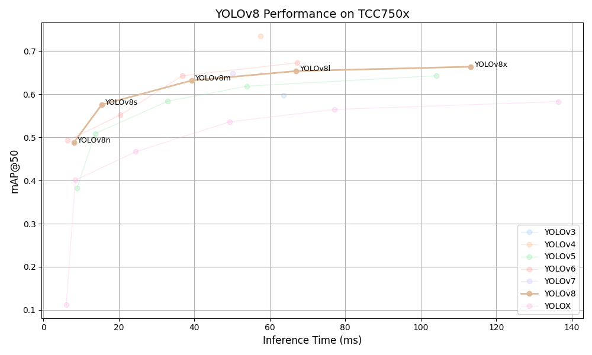

# YOLOv8 Benchmark on TCC750x

<table border="1" cellspacing="0" cellpadding="5">
    <thead>
        <tr>
            <th align="center" rowspan="2" colspan="2">Model</th>
            <th th align="center" rowspan="2">Framework</th>
            <th th align="center" rowspan="2">Dataset</th>
            <th th align="center" rowspan="2">Input Size (WxHxC)</th>
            <th th align="center" rowspan="2">Quantization Bit</th>
            <th th align="center" colspan="2">Binary Files Info.</th>
            <th th align="center" rowspan="2">Inference Time(ms)</th>
            <th th align="center" colspan="2">mAP@50-95</th>
            <th th align="center" colspan="2">mAP@50</th>
            <th th align="center" rowspan="2">References</th>
        </tr>
        <tr>
            <th>Weight and Bias Binary (MB)</th>
            <th>Command Binary (KB)</th>
            <th>FP32</th>
            <th>INT8</th>
            <th>FP32</th>
            <th>INT8</th>
        </tr>
    </thead>
    <tbody>
        <tr>
            <td align="center" rowspan="5" class="model">YOLOv8</td> <!-- Model -->
            <td align="center" class="variant"><a href="Yolo/yolov8/yolov8n/">n</a></td>
            <td align="center">PyTorch</td> <!-- Framework -->
            <td align="center">COCO</td> <!-- Detections/DataSet -->
            <td align="center">640x640x3</td> <!-- Input Size (WxHxC) -->
            <td align="center">INT8</td> <!-- Quantization Bit -->
            <td align="center">4</td> <!-- Compiled NN Information: Weight, Bias Binary Size(MB) -->
            <td align="center">72</td> <!-- Compiled NN Information: Command Binary Size(KB) -->
            <td align="center">8.63</td> <!-- Inference Time(msec): EVB -->
            <td align="center">0.344</td> <!-- Evaluation Result: FP32 IoU=0.50:0.95 -->
            <td align="center">0.331</td> <!-- Evaluation Result: INT8 IoU=0.50:0.95 -->
            <td align="center">0.501</td> <!-- Evaluation Result: FP32 IoU=0.50 -->
            <td align="center">0.488</td> <!-- Evaluation Result: INT8 IoU=0.50 -->
            <td align="center" rowspan="5"><a href="https://github.com/ultralytics/ultralytics">GitHub<a></td> <!-- References: Link -->
        </tr>
        <tr>
            <td align="center" class="variant"><a href="Yolo/yolov8/yolov8s/">s</a></td> <!-- Model -->
            <td align="center">PyTorch</td> <!-- Framework -->
            <td align="center">COCO</td> <!-- Detections/DataSet -->
            <td align="center">640x640x3</td> <!-- Input Size (WxHxC) -->
            <td align="center">INT8</td> <!-- Quantization Bit -->
            <td align="center">11</td> <!-- Compiled NN Information: Weight, Bias Binary Size(MB) -->
            <td align="center">92</td> <!-- Compiled NN Information: Command Binary Size(KB) -->
            <td align="center">16.17</td> <!-- Inference Time(msec): EVB -->
            <td align="center">0.416</td> <!-- Evaluation Result: FP32 IoU=0.50:0.95 -->
            <td align="center">0.405</td> <!-- Evaluation Result: INT8 IoU=0.50:0.95 -->
            <td align="center">0.586</td> <!-- Evaluation Result: FP32 IoU=0.50 -->
            <td align="center">0.576</td> <!-- Evaluation Result: INT8 IoU=0.50 -->
        </tr>
        <tr>
            <td align="center" class="variant"><a href="Yolo/yolov8/yolov8m/">m</a></td> <!-- Model -->
            <td align="center">PyTorch</td> <!-- Framework -->
            <td align="center">COCO</td> <!-- Detections/DataSet -->
            <td align="center">640x640x3</td> <!-- Input Size (WxHxC) -->
            <td align="center">INT8</td> <!-- Quantization Bit -->
            <td align="center">25</td> <!-- Compiled NN Information: Weight, Bias Binary Size(MB) -->
            <td align="center">156</td> <!-- Compiled NN Information: Command Binary Size(KB) -->
            <td align="center">45.35</td> <!-- Inference Time(msec): EVB -->
            <td align="center">0.472</td> <!-- Evaluation Result: FP32 IoU=0.50:0.95 -->
            <td align="center">0.458</td> <!-- Evaluation Result: INT8 IoU=0.50:0.95 -->
            <td align="center">0.644</td> <!-- Evaluation Result: FP32 IoU=0.50 -->
            <td align="center">0.632</td> <!-- Evaluation Result: INT8 IoU=0.50 -->
        </tr>
        <tr>
            <td align="center" class="variant"><a href="Yolo/yolov8/yolov8l/">l</a></td> <!-- Model -->
            <td align="center">PyTorch</td> <!-- Framework -->
            <td align="center">COCO</td> <!-- Detections/DataSet -->
            <td align="center">640x640x3</td> <!-- Input Size (WxHxC) -->
            <td align="center">INT8</td> <!-- Quantization Bit -->
            <td align="center">42</td> <!-- Compiled NN Information: Weight, Bias Binary Size(MB) -->
            <td align="center">248</td> <!-- Compiled NN Information: Command Binary Size(KB) -->
            <td align="center">69.16</td> <!-- Inference Time(msec): EVB -->
            <td align="center">0.499</td> <!-- Evaluation Result: FP32 IoU=0.50:0.95 -->
            <td align="center">0.483</td> <!-- Evaluation Result: INT8 IoU=0.50:0.95 -->
            <td align="center">0.670</td> <!-- Evaluation Result: FP32 IoU=0.50 -->
            <td align="center">0.654</td> <!-- Evaluation Result: INT8 IoU=0.50 -->
        </tr>
        <tr>
            <td align="center" class="variant"><a href="Yolo/yolov8/yolov8x/">x</a></td> <!-- Model -->
            <td align="center">PyTorch</td> <!-- Framework -->
            <td align="center">COCO</td> <!-- Detections/DataSet -->
            <td align="center">640x640x3</td> <!-- Input Size (WxHxC) -->
            <td align="center">INT8</td> <!-- Quantization Bit -->
            <td align="center">66</td> <!-- Compiled NN Information: Weight, Bias Binary Size(MB) -->
            <td align="center">436</td> <!-- Compiled NN Information: Command Binary Size(KB) -->
            <td align="center">118.06</td> <!-- Inference Time(msec): EVB -->
            <td align="center">0.508</td> <!-- Evaluation Result: FP32 IoU=0.50:0.95 -->
            <td align="center">0.493</td> <!-- Evaluation Result: INT8 IoU=0.50:0.95 -->
            <td align="center">0.681</td> <!-- Evaluation Result: FP32 IoU=0.50 -->
            <td align="center">0.664</td> <!-- Evaluation Result: INT8 IoU=0.50 -->
        </tr>
    </tbody>
</table>